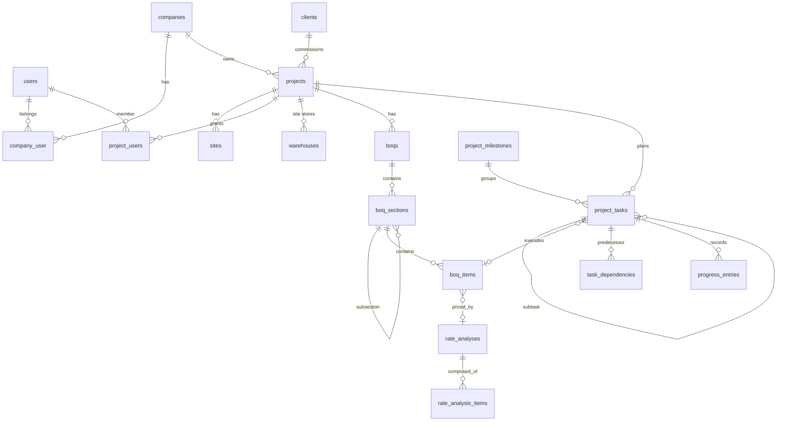
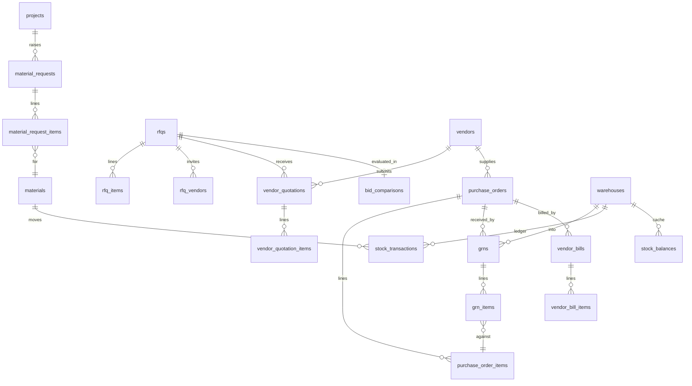
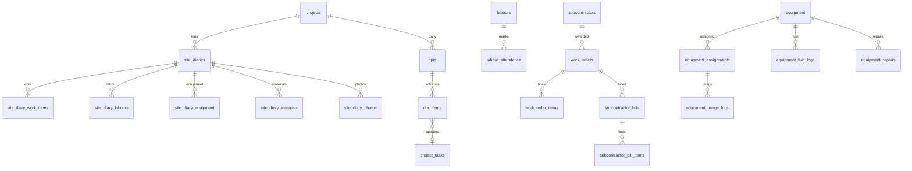
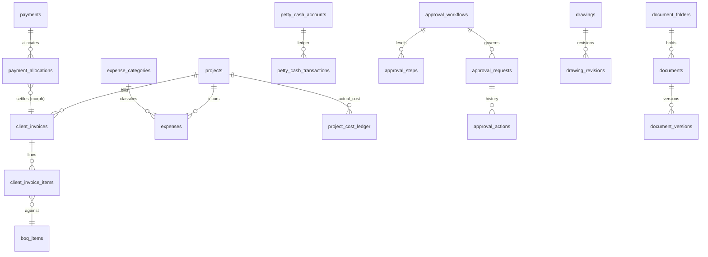
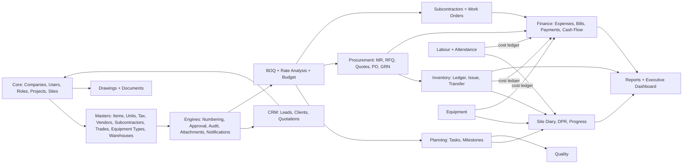
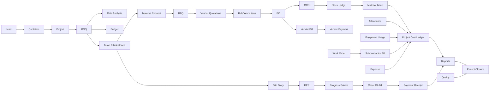

# BUILDIFY360 — Construction Project Management ERP

## Architecture Document

| | |
|---|---|
| Version | 0.2 (Phase 1 implemented) |
| Date | 2026-09-29 (implementation status updated 2026-10-01) |
| Status | Phase 0 and Phase 1 complete and verified, see [section S](#s-implementation-status). Phase 2 not started. |
| Repository | `c:\wamp64\www\tiwanaerp` (remote `origin` → `github.com/Pawanks7861/tiwanaerp`) |

---

## Table of Contents

- [A. Existing Architecture](#a-existing-architecture)
- [B. Existing Database Tables](#b-existing-database-tables)
- [C. Existing Modules](#c-existing-modules)
- [D. Features We Can Reuse](#d-features-we-can-reuse)
- [E. Features Missing](#e-features-missing)
- [F. Recommended System Architecture](#f-recommended-system-architecture)
- [G. Suggested Folder Structure](#g-suggested-folder-structure)
- [H. Database Architecture](#h-database-architecture)
- [I. Statuses and Workflows](#i-statuses-and-workflows)
- [J. Cross-Cutting Engines](#j-cross-cutting-engines)
- [K. Route Architecture](#k-route-architecture)
- [L. API Architecture](#l-api-architecture)
- [M. Permission Architecture](#m-permission-architecture)
- [N. Security](#n-security)
- [O. UI/UX Architecture](#o-uiux-architecture)
- [P. Development Phase Plan](#p-development-phase-plan)
- [Q. Quality Gates per Module](#q-quality-gates-per-module)
- [R. Open Decisions](#r-open-decisions)
- [S. Implementation Status](#s-implementation-status)

---

## A. Existing Architecture

Repository scan result (2026-09-29):

| Check | Finding |
|---|---|
| Files in working tree | None except `.git/` |
| Git history | Branch `main`, **no commits** |
| Remote | `origin` → `https://github.com/Pawanks7861/tiwanaerp.git` |
| `composer.json` / `package.json` | Not present |
| Laravel app, migrations, Vue pages | Not present |

**Conclusion:** this is a **greenfield** project. There is no existing functionality that could break, so nothing needs to be preserved or migrated. The rule "do not replace existing working functionality" still applies from the first commit onward.

### Local environment findings

| Tool | Found | Required | Action |
|---|---|---|---|
| PHP CLI (default on `PATH`) | 8.1.28 | 8.3+ (Laravel 13) | Not changed. The project uses WAMP's PHP **8.3.6** session-locally via `scripts/dev-env.ps1` / `scripts/artisan.cmd`. |
| Composer | 2.6.5 | 2.x | OK (running `composer self-update` is recommended). Called through `composer.bat`, so use `~` constraints on the command line; `cmd` strips `^`. |
| Node.js / npm (global) | 20.18.0 / 10.9.0 | ^20.19 or >=22.12 (Vite 8) | Not changed. The project uses a portable **Node 22.23.3** in `.tools/node` (checksum-verified from nodejs.org), put on `PATH` session-locally by `scripts/dev-env.ps1`. |
| MySQL server | 8.3.0 (WAMP, 127.0.0.1) | 8.0+ | OK. Project database: `tiwanaerp`. |

### Framework version decision (2026-10-01)

The original target was Laravel 11. During Phase 0 `composer audit` reported four advisories against Laravel 11 (XSS on the debug page, CRLF injection in the default email rule, signed-URL path confusion) that are fixed only in 12.x/13.x, because Laravel 11 no longer receives security releases. With the owner's approval the project targets **Laravel 13** (PHP 8.3+). The architecture, layers, folder structure and package set are unchanged.

Required PHP extensions: `bcmath`, `intl`, `gd` (or `imagick`), `zip`, `fileinfo`, `pdo_mysql`, `mbstring`, `openssl`.

---

## B. Existing Database Tables

None. The full schema is defined in [section H](#h-database-architecture).

## C. Existing Modules

None.

## D. Features We Can Reuse

There is no in-repo code to reuse. The plan leans on mature, MIT-licensed ecosystem packages instead of hand-writing infrastructure:

| Concern | Package | Why |
|---|---|---|
| Auth scaffolding (login, reset, profile) | `laravel/breeze` (Vue + Inertia stack) | Official, minimal, fully owned code after install |
| Roles and permissions | `spatie/laravel-permission` with **teams mode** (team = company) | Industry standard, supports per-company roles |
| API tokens (mobile) | `laravel/sanctum` | First-party; SPA + token auth |
| Route helper in Vue | `tightenco/ziggy` | Named routes in JS |
| Excel import/export | `maatwebsite/excel` | BOQ import, report export |
| PDF generation | `barryvdh/laravel-dompdf` | PO, DPR, RA bill PDFs. `spatie/browsershot` is the upgrade path if pixel-perfect output is needed. |
| Exact decimal math | `brick/math` | Avoids float math in money and quantity calculations |
| Charts | `apexcharts` + `vue3-apexcharts` | Dashboards |
| Gantt (Phase 2+) | `frappe-gantt` | Lightweight, MIT |
| Client-side decimal preview | `decimal.js` | Live form totals only; the server stays authoritative |
| Testing | `pestphp/pest` | Readable feature tests |

**Deliberately not used:**

- jQuery DataTables. It conflicts with Vue reactivity. We build our own server-side `DataTable.vue` on top of Inertia pagination.
- Module packages (`nwidart/laravel-modules`). Domain subfolders inside standard Laravel directories are enough and keep tooling simple.
- Microservices. The app is a single modular monolith.

## E. Features Missing

Everything in the requirement is missing. The complete module list:

| # | Module | Phase |
|---|---|---|
| 1 | Tenancy (companies), users, roles, permissions, project access | 1 |
| 2 | Masters (items, units, categories, tax rates, vendors, subcontractors, labour trades, equipment types, warehouses, expense categories) | 1 |
| 3 | Projects, sites, project dashboard | 1 |
| 4 | Document numbering, audit trail, attachments, approval engine (foundation) | 1 |
| 5 | CRM: leads, clients, quotations | 1 (clients), 7 (leads, quotations) |
| 6 | BOQ, rate analysis, budget | 2 |
| 7 | Planning: tasks, WBS, dependencies, milestones, Gantt data | 2 |
| 8 | Procurement: material requests, RFQ, vendor quotations, bid comparison, PO, GRN | 3 |
| 9 | Inventory: stock ledger, issue, transfer, return, adjustment | 4 |
| 10 | Site execution: site diary, DPR, progress tracking, photos | 5 |
| 11 | Labour, attendance, labour payments | 6 |
| 12 | Subcontractors, work orders, subcontractor bills | 6 |
| 13 | Equipment, assignments, usage, fuel, repairs | 6 |
| 14 | Finance: expenses, petty cash, client RA bills, vendor bills, payments, retention, cash flow | 7 |
| 15 | Quality: checklists, inspections, NCR | 8 |
| 16 | Drawings with revisions; documents with versions | 8 |
| 17 | Reports (PDF/Excel), notifications, audit log viewer, executive dashboard | 9 |

---

## F. Recommended System Architecture

### F.1 Style

A **modular monolith** on Laravel 13:

```
                ┌──────────────────────────────────────────────┐
 Browser ──────▶│ Web routes (Inertia)   ──▶ Web Controllers   │
 (Vue 3 SPA)    │                                   │          │
                │                                   ▼          │
 Flutter app ──▶│ API routes /api/v1 (Sanctum) ─▶ API Ctrls    │
 (future)       │                                   │          │
                │        Form Requests (shared validation)     │
                │                                   ▼          │
                │   Policies ──▶ Services (business rules)     │
                │                    │         │         │     │
                │               Engines:  Approval | Numbering │
                │               StockLedger | CostLedger | Audit│
                │                    ▼                         │
                │   Eloquent Models (company-scoped) ──▶ MySQL │
                │                    │                         │
                │   Events ──▶ Listeners ──▶ Jobs (queue)      │
                │                         └─▶ Notifications    │
                └──────────────────────────────────────────────┘
```

### F.2 Layer responsibilities

| Layer | Responsibility | Must not |
|---|---|---|
| Controller (Web / API) | Authorize, call a service, return an Inertia page or an API Resource | Contain business rules, calculations, or DB transactions |
| Form Request | Validation plus tenant-safe `exists` rules | Mutate data |
| Policy | Permission + company + project membership + document state (for example, locked when approved) | Query unrelated data |
| Service | Business rules, calculations, `DB::transaction`, dispatching events | Know about HTTP or Inertia |
| Model | Relations, casts, scopes, state helpers (`isLocked()`) | Contain workflow logic |
| Event / Listener | Side effects (stock posting, cost posting, notifications) | Be the only place a critical invariant is enforced |
| Job | Slow work: PDFs, imports, bulk notifications, scheduled scans | |
| Vue | Presentation, forms, live preview of totals | Be the source of truth for any rule or total |

The web and API controllers share the **same Form Requests, Policies and Services**. Business rules therefore live in exactly one place, and the future mobile app gets identical behaviour.

Repositories are **not** used by default. Eloquent plus query scopes is enough. A dedicated query class (for example `app/Queries/Reports/BudgetVsActualQuery.php`) is introduced only for complex report SQL.

### F.3 Multi-tenancy

- **Single database, shared schema**, with a `company_id` column on every tenant-owned table.
- `App\Support\Tenancy\CurrentCompany` resolves the active company:
  - Web: `session('current_company_id')`, validated against `company_user` on every request by the `SetCurrentCompany` middleware.
  - API: the `X-Company-Id` header, validated against the token user's memberships.
- The `BelongsToCompany` model trait:
  - adds a global scope `where company_id = current`;
  - sets `company_id` automatically on `creating`;
  - the scope can only be bypassed explicitly with `withoutCompanyScope()` for super-admin tooling.
- Nested routes use `scopeBindings()`, so `/projects/5/purchase-orders/99` returns 404 if PO 99 does not belong to project 5.
- A custom validation rule `ExistsInCompany` replaces bare `exists:` rules, so a vendor ID from another company cannot be submitted.
- Pest tests assert that cross-company access returns 404 for every module (see [section Q](#q-quality-gates-per-module)).

### F.4 Money, quantity and precision rules

| Kind | Column type | Example |
|---|---|---|
| Money amounts (totals, bill values) | `decimal(18,2)` | `grand_total` |
| Unit rates / prices | `decimal(18,4)` | `rate` |
| Quantities | `decimal(18,4)` | `quantity`, `qty_in` |
| Percentages (tax, margin, retention) | `decimal(7,4)` | `retention_percent` |
| Hours | `decimal(8,2)` | `working_hours` |
| Latitude / longitude | `decimal(10,7)` | `latitude` |

- Eloquent casts use `decimal:N`, which returns strings and never floats.
- All calculations go through `App\Support\Math\Decimal`, a thin wrapper over `brick/math` `BigDecimal` with `HALF_UP` rounding.
- Line amounts are rounded to 2 decimals **per line**; document totals are the sum of rounded lines, plus an explicit `round_off` column. This matches how Indian GST invoices are printed.

### F.5 Ledgers over stored balances

Three append-only ledgers hold the numbers that matter. Balances are **derived**:

| Ledger | Source of truth for | Posted by |
|---|---|---|
| `stock_transactions` | Stock quantity and value per warehouse and item | GRN approval, material issue, transfer, return, adjustment |
| `project_cost_ledger` | Actual cost per project, cost head, BOQ item and task | Material issue, labour attendance approval, equipment usage, subcontractor bill certification, approved expense, vendor bill (direct) |
| `progress_entries` | Executed quantity per task and BOQ item | DPR approval |

Rules:

- Ledger rows are **never updated or deleted**. Corrections are made with reversing entries that reference the original row.
- `stock_balances` is a **cache** (quantity + weighted average cost per warehouse and item). It is updated in the same transaction as the ledger insert, using `lockForUpdate()`. It exists to prevent negative stock under concurrency and to keep lists fast. The `inventory:reconcile` command recomputes it from the ledger and reports any drift.
- Cached columns such as `project_tasks.completed_qty` follow the same rule: they are derived, recomputable, and never the only record.

### F.6 Queues, scheduler, storage

- Queue: `database` driver initially (works on WAMP with no extra services). Redis later.
- Scheduler jobs: overdue tasks (daily), delayed-activity flagging (daily), low-stock scan (daily), notification digest (later).
- Files: `private` disk (`storage/app/private`). Every download goes through a controller that authorizes the parent record. There are no public URLs for project files. The S3-compatible disk is a config switch later.

---

## G. Suggested Folder Structure

```
app/
├── Enums/                         # Backed enums: statuses, types (e.g. PurchaseOrderStatus)
│   ├── Procurement/
│   └── ...
├── Events/<Module>/               # PurchaseOrderApproved, GrnApproved, DprApproved ...
├── Listeners/<Module>/
├── Jobs/                          # GeneratePdf, ImportBoq, ScanLowStock, FlagDelayedTasks
├── Notifications/                 # ApprovalRequested, PoApproved, LowStock ...
├── Exports/  Imports/             # maatwebsite/excel classes
├── Http/
│   ├── Controllers/
│   │   ├── Web/<Module>/          # Inertia controllers
│   │   └── Api/V1/<Module>/       # JSON controllers (mobile)
│   ├── Middleware/                # SetCurrentCompany, EnsureProjectAccess, HandleInertiaRequests
│   ├── Requests/<Module>/         # StorePurchaseOrderRequest ...
│   └── Resources/<Module>/        # API Resources (also used as Inertia props where handy)
├── Models/
│   ├── Concerns/                  # BelongsToCompany, Blameable, Auditable, HasApprovals,
│   │                              # HasDocumentNumber, HasAttachments, LocksWhenApproved
│   ├── Core/  Crm/  Boq/  Planning/  Procurement/  Inventory/  Site/
│   ├── Labour/  Subcontract/  Equipment/  Finance/  Quality/  Documents/  Approval/
├── Policies/<Module>/
├── Queries/Reports/               # Complex report SQL only
├── Services/
│   ├── Approval/ApprovalService.php
│   ├── Numbering/DocumentNumberService.php
│   ├── Inventory/StockLedgerService.php
│   ├── Costing/CostLedgerService.php
│   ├── Tax/GstCalculator.php
│   ├── Boq/RateAnalysisCalculator.php
│   └── <Module>/<Entity>Service.php
├── Support/
│   ├── Math/Decimal.php
│   └── Tenancy/CurrentCompany.php
└── Rules/ExistsInCompany.php

resources/
├── js/
│   ├── Layouts/  AppLayout.vue, ProjectLayout.vue, GuestLayout.vue, MobileShell.vue
│   ├── Components/
│   │   ├── ui/        Button, Card, Modal, Drawer, Tabs, Badge, StatusBadge, EmptyState
│   │   ├── form/      TextInput, Select, SearchSelect, MoneyInput, QtyInput, DateInput,
│   │   │              FileUpload, PhotoCapture, LineItemsEditor
│   │   ├── data/      DataTable, FilterBar, Pagination, ResponsiveList (cards on mobile)
│   │   ├── charts/    KpiCard, BarChart, DonutChart, LineChart
│   │   └── domain/    ApprovalTimeline, AuditTrail, ProjectHeader, AttachmentList
│   ├── Composables/   usePermissions, useFilters, useFormat (display only), useGeo
│   └── Pages/<Module>/<Entity>/ Index.vue, Create.vue, Edit.vue, Show.vue
└── views/pdf/         po.blade.php, dpr.blade.php, ra-bill.blade.php ...

database/
├── migrations/        # One migration per module group, ordered by dependency
├── seeders/           # Permissions, default roles, units, tax rates, demo company
└── factories/

tests/
├── Feature/<Module>/  # CRUD, permissions, tenancy isolation, workflows
└── Unit/              # Calculators, numbering, decimal math
```

---

## H. Database Architecture

### H.1 Conventions (apply to every table unless stated)

| Convention | Rule |
|---|---|
| Primary key | `id` bigint unsigned auto-increment. `uuid` column only where exposed to mobile sync (Site Diary, attendance, photos). |
| Tenant column | `company_id` FK → `companies`, `restrictOnDelete`, indexed (normally as the first column of composite indexes) |
| Blame columns ("std") | `created_by`, `updated_by`, `deleted_by` FK → `users`, `nullOnDelete` |
| Timestamps | `created_at`, `updated_at` |
| Soft deletes | Masters and documents: yes. Ledgers, audit logs, approval actions: **no** (append-only). |
| Document numbers | Unique per company: `unique(company_id, <number_col>)` |
| Status | `varchar(30)` mapped to a PHP backed enum. Not MySQL `ENUM`, so adding a status needs no ALTER. Indexed with `company_id`. |
| Approval stamp | `approved_by`, `approved_at` on approvable documents (denormalized from the approval engine for fast listing) |

**Delete behaviour**

| Relationship | On delete |
|---|---|
| Any → `companies` | `restrict` (companies are soft-deleted only) |
| Document header → its line items | `cascade` (the app only allows header deletion in Draft) |
| Line / document → masters (item, unit, vendor, warehouse) | `restrict` (masters are deactivated or soft-deleted instead) |
| Optional references (BOQ item on an MR line, task on a diary line) | `nullOnDelete` |
| Anything → ledgers | `restrict`. Ledgers are never deleted. |
| Blame columns → `users` | `nullOnDelete`. Users are deactivated, not deleted. |

"std" below means the standard blame columns plus timestamps. "sd" means soft deletes.

### H.2 Core, tenancy and access

| Table | Key columns | Constraints / indexes |
|---|---|---|
| `companies` | name, legal_name, code, gstin, pan, state_code, address, phone, email, logo_path, currency (default `INR`), fy_start_month (default 4), timezone, is_active, std, sd | unique(code) |
| `company_settings` | company_id, key, value (json) | unique(company_id, key) |
| `financial_years` | company_id, name (`2026-27`), start_date, end_date, is_current | unique(company_id, name) |
| `users` | name, email, mobile, password, current_company_id, is_super_admin, is_active, last_login_at, remember_token, std | unique(email) |
| `company_user` | company_id, user_id, user_type (`staff`/`vendor`/`subcontractor`/`client`), party_type, party_id (morph to vendor/subcontractor/client for portal users), is_active | unique(company_id, user_id) |
| `roles`, `permissions`, `model_has_roles`, `model_has_permissions`, `role_has_permissions` | spatie tables with `team_id` = company_id | per spatie |
| `personal_access_tokens` | Sanctum | |
| `notifications` | Laravel default (uuid, type, notifiable morph, data json, read_at) | index(notifiable_type, notifiable_id, read_at) |
| `notification_preferences` | user_id, notification_type, channels (json: database, mail, whatsapp, push) | unique(user_id, notification_type) |
| `device_tokens` | user_id, platform, token, last_seen_at (for future push) | unique(token) |

### H.3 Projects and sites

| Table | Key columns | Constraints / indexes |
|---|---|---|
| `projects` | company_id, client_id, project_number (`PRJ-2026-0001`), code (`PRJ001`, used in document numbers), name, description, project_type, address, city, state_code, latitude, longitude, project_manager_id, start_date, expected_end_date, actual_end_date, contract_value (18,2), status, std, sd | unique(company_id, project_number), unique(company_id, code), index(company_id, status) |
| `sites` | company_id, project_id, name, address, latitude, longitude, geofence_radius_m, is_active, std, sd | index(project_id) |
| `project_users` | project_id, user_id, project_role (`manager`/`engineer`/`viewer`/...), is_active, std | unique(project_id, user_id) |
| `project_settings` | project_id, key, value (json) | unique(project_id, key) |
| `project_budgets` | company_id, project_id, version, source (`boq`/`manual`), boq_id, status, total_amount, approved_by/at, std, sd | unique(project_id, version) |
| `project_budget_lines` | project_budget_id, cost_head (`material`/`labour`/`equipment`/`subcontract`/`overhead`/`other`), boq_item_id (nullable), description, amount (18,2) | index(project_budget_id, cost_head) |

### H.4 Masters

| Table | Key columns | Constraints / indexes |
|---|---|---|
| `units` | company_id (nullable = global seed), name, symbol, decimal_places, is_active | unique(company_id, symbol) |
| `material_categories` | company_id, parent_id (self), name, code | unique(company_id, code) |
| `tax_rates` | company_id, name, rate, cgst_rate, sgst_rate, igst_rate, cess_rate, is_active | unique(company_id, name) |
| `materials` (UI name "Items") | company_id, category_id, item_type (`material`/`consumable`/`asset`/`service`), code, name, description, hsn_sac, unit_id, tax_rate_id, reorder_level (18,4), standard_rate (18,4), is_active, std, sd | unique(company_id, code), index(company_id, category_id) |
| `vendors` | company_id, code, name, contact_person, mobile, email, gstin, pan, state_code, address, payment_terms, bank_name, bank_account_no, bank_ifsc, is_active, std, sd | unique(company_id, code), index(company_id, gstin) |
| `vendor_material` | vendor_id, material_id, last_rate (optional preferred-supplier mapping) | unique(vendor_id, material_id) |
| `subcontractors` | company_id, code, name, contact_person, mobile, email, trade, gstin, pan, state_code, address, bank_*, is_active, std, sd | unique(company_id, code) |
| `labour_trades` | company_id, name (Mason, Helper, Carpenter, ...), default_daily_wage | unique(company_id, name) |
| `equipment_types` | company_id, name | unique(company_id, name) |
| `warehouses` | company_id, project_id (nullable = central store), site_id (nullable), code, name, type (`central`/`site`), address, is_active, std, sd | unique(company_id, code) |
| `expense_categories` | company_id, name, cost_head (maps expenses into the cost ledger), is_active | unique(company_id, name) |
| `clients` (CRM master) | company_id, code, company_name, contact_person, mobile, email, gstin, pan, state_code, billing_address, shipping_address, std, sd | unique(company_id, code) |

### H.5 CRM

| Table | Key columns | Constraints / indexes |
|---|---|---|
| `leads` | company_id, lead_number, client_id (nullable), name, contact_person, mobile, email, source, project_type, location, estimated_value, expected_start, assigned_to, status, lost_reason, std, sd | unique(company_id, lead_number), index(company_id, status) |
| `lead_activities` | lead_id, type (call/visit/email/note), notes, activity_at, user_id | index(lead_id) |
| `quotations` | company_id, quotation_number, lead_id, client_id, revision, quote_date, valid_until, subtotal, tax_amount, total, terms, status, converted_project_id, std, sd | unique(company_id, quotation_number, revision) |
| `quotation_items` | quotation_id, description, hsn_sac, unit_id, quantity, rate, tax_rate_id, amount, sort_order | cascade on quotation |

### H.6 BOQ and rate analysis

| Table | Key columns | Constraints / indexes |
|---|---|---|
| `boqs` | company_id, project_id, boq_number, version, parent_boq_id (previous version), title, status, is_current, total_cost_amount, total_client_amount, approved_by/at, std, sd | unique(company_id, boq_number, version), index(project_id, is_current) |
| `boq_sections` | boq_id, parent_id (self, for subsections), code, name, discipline, sort_order | index(boq_id, parent_id) |
| `boq_items` | boq_id, boq_section_id, line_uid (uuid, stable across versions), item_code, name, description, hsn_sac, unit_id, quantity, material_rate, labour_rate, equipment_rate, subcontract_rate, cost_rate, cost_amount, margin_percent, selling_rate, client_rate, client_amount, rate_analysis_id, sort_order | index(boq_id, boq_section_id), index(line_uid) |
| `rate_analyses` | company_id, project_id (nullable = company library template), code, name, unit_id, output_quantity (the analysis basis, e.g. per 1 cum), overhead_percent, profit_percent, material_cost, labour_cost, equipment_cost, subcontract_cost, overhead_amount, profit_amount, total_cost, unit_rate, status, std, sd | unique(company_id, code) |
| `rate_analysis_items` | rate_analysis_id, resource_type (`material`/`labour`/`equipment`/`subcontract`/`other`), material_id / labour_trade_id / equipment_type_id (one set), description, unit_id, quantity, wastage_percent, rate, amount, sort_order | cascade on rate analysis |

**BOQ versioning:** an approved BOQ is immutable. "Revise" clones it into version N+1 (Draft) and copies each `line_uid`. When the new version is approved, the old one becomes `revised` and `is_current` moves to the new one. Downstream quantities (billing, progress, work orders) aggregate by `line_uid`, so cumulative quantities continue correctly across revisions.

### H.7 Planning and progress

| Table | Key columns | Constraints / indexes |
|---|---|---|
| `project_milestones` | company_id, project_id, name, due_date, completed_at, billing_percent, status, sort_order, std | index(project_id, due_date) |
| `project_tasks` | company_id, project_id, parent_id (self), milestone_id, boq_item_id, wbs_code, name, description, assigned_to, priority, planned_start, planned_finish, duration_days, actual_start, actual_finish, unit_id, planned_qty, completed_qty (cache), progress_percent (cache), budget_amount, actual_cost (cache), status, sort_order, std, sd | unique(project_id, wbs_code), index(project_id, parent_id), index(assigned_to, status) |
| `task_dependencies` | predecessor_id, successor_id, type (`FS`/`SS`/`FF`/`SF`), lag_days | unique(predecessor_id, successor_id) |
| `progress_entries` (ledger) | company_id, project_id, task_id, boq_item_id, boq_line_uid, entry_date, quantity, source_type, source_id (morph, e.g. DPR item), reverses_id, created_by, created_at | index(task_id, entry_date), index(project_id, boq_line_uid) |

The "activity" in the progress requirement **is** a `project_task`. There is no second activity table, which avoids two sources of truth for plan and progress. Delay days are computed (an accessor, not a column):

- not completed: `max(0, today − planned_finish)`
- completed: `actual_finish − planned_finish`

### H.8 Procurement

| Table | Key columns | Constraints / indexes |
|---|---|---|
| `material_requests` | company_id, project_id, site_id, request_number, request_date, required_date, requested_by, priority, remarks, status, approved_by/at, std, sd | unique(company_id, request_number), index(project_id, status) |
| `material_request_items` | material_request_id, material_id, boq_item_id, task_id, unit_id, quantity, ordered_qty (cache), received_qty (cache), remarks | cascade on MR |
| `rfqs` | company_id, project_id, rfq_number, rfq_date, due_date, required_date, terms, status, std, sd | unique(company_id, rfq_number) |
| `rfq_items` | rfq_id, material_request_item_id (nullable), material_id, unit_id, quantity, required_date, specification | cascade |
| `rfq_vendors` | rfq_id, vendor_id, sent_at, responded_at, status | unique(rfq_id, vendor_id) |
| `vendor_quotations` | company_id, rfq_id, vendor_id, quotation_number (vendor ref), quotation_date, valid_until, delivery_days, payment_terms, warranty, freight_amount, discount_amount, other_charges, subtotal, tax_amount, grand_total, remarks, is_selected, std, sd | unique(rfq_id, vendor_id) |
| `vendor_quotation_items` | vendor_quotation_id, rfq_item_id, rate, discount_percent, tax_rate_id, tax_amount, amount, remarks | unique(vendor_quotation_id, rfq_item_id) |
| `bid_comparisons` | company_id, rfq_id, selected_vendor_quotation_id, selection_basis, justification, status, approved_by/at, std | unique(rfq_id) |
| `purchase_orders` | company_id, project_id, vendor_id, po_number, revision_no, rfq_id, vendor_quotation_id, po_date, delivery_date, billing_address, shipping_address, place_of_supply_state, tax_type (`intra`/`inter`), payment_terms, remarks, subtotal, discount_amount, taxable_amount, cgst_amount, sgst_amount, igst_amount, freight_amount, other_charges, round_off, grand_total, status, approved_by/at, cancelled_reason, std, sd | unique(company_id, po_number), index(project_id, status), index(vendor_id, po_date) |
| `purchase_order_items` | purchase_order_id, material_request_item_id, material_id, item_code, description, hsn_sac, unit_id, quantity, rate, discount_percent, tax_rate_id, cgst_rate/amount, sgst_rate/amount, igst_rate/amount, taxable_amount, amount, received_qty (cache) | cascade |
| `purchase_order_revisions` | purchase_order_id, revision_no, snapshot (json), reason, created_by | unique(purchase_order_id, revision_no) |
| `grns` | company_id, project_id, purchase_order_id, vendor_id, warehouse_id, grn_number, receipt_date, vendor_invoice_no, vendor_challan_no, vehicle_no, remarks, status, approved_by/at, std, sd | unique(company_id, grn_number), index(purchase_order_id) |
| `grn_items` | grn_id, purchase_order_item_id, material_id, unit_id, ordered_qty (snapshot), previously_received_qty (snapshot), received_qty, rejected_qty, accepted_qty, rejection_reason, rate | cascade. CHECK: accepted = received − rejected |

**Tax type rule:** `intra` (CGST + SGST) when the vendor state equals the place of supply (project or warehouse state); otherwise `inter` (IGST). This is computed by `GstCalculator` and never chosen in the UI.

### H.9 Inventory

| Table | Key columns | Constraints / indexes |
|---|---|---|
| `stock_transactions` (ledger) | company_id, project_id, warehouse_id, material_id, txn_date, txn_type, qty_in, qty_out, unit_cost (18,4), value (18,2), source_type, source_id (morph), reverses_id, remarks, created_by, created_at | index(warehouse_id, material_id, txn_date), index(project_id, material_id), index(source_type, source_id) |
| `stock_balances` (cache) | company_id, warehouse_id, material_id, quantity, avg_cost, value, updated_at | unique(warehouse_id, material_id) |
| `material_issues` + `_items` | issue_number, project_id, warehouse_id, issue_date, issued_to (user/subcontractor), task_id; items: material_id, boq_item_id, task_id, quantity, unit_cost (filled at posting) | unique(company_id, issue_number) |
| `stock_transfers` + `_items` | transfer_number, from_warehouse_id, to_warehouse_id, transfer_date, status (`draft`/`dispatched`/`received`), items: material_id, quantity, received_qty | unique(company_id, transfer_number) |
| `material_returns` + `_items` | return_number, type (`site_to_store`/`to_vendor`), project_id, warehouse_id, vendor_id (for vendor returns), grn_id; items | unique(company_id, return_number) |
| `stock_adjustments` + `_items` | adjustment_number, warehouse_id, reason (`damage`/`theft`/`count_correction`/`opening`), items: material_id, system_qty (snapshot), physical_qty, difference | unique(company_id, adjustment_number) |

`txn_type` values: `opening`, `grn_in`, `issue_out`, `transfer_out`, `transfer_in`, `return_in`, `return_to_vendor_out`, `adjustment_in`, `adjustment_out`, `reversal`.

**Valuation:** weighted average cost per warehouse and item. A material issue to a project posts `issue_out` in `stock_transactions` **and** a `material` row in `project_cost_ledger`. That issue is the moment material becomes project cost.

**Site diary material usage** is informational (what was used on site today). It is reconciled against issues in the Material Consumption report but does not move stock, which prevents double counting.

### H.10 Site execution

| Table | Key columns | Constraints / indexes |
|---|---|---|
| `site_diaries` | uuid, company_id, project_id, site_id, diary_date, weather, temperature, work_location, work_performed, issues, safety_incidents, remarks, latitude, longitude, captured_at, status, submitted_by/at, reviewed_by/at, approved_by/at, std, sd | unique(uuid), index(project_id, diary_date), index(created_by, diary_date) |
| `site_diary_work_items` | site_diary_id, task_id, boq_item_id, subcontractor_id, description, quantity, unit_id | cascade |
| `site_diary_labours` | site_diary_id, labour_trade_id, subcontractor_id, headcount, hours | cascade |
| `site_diary_equipment` | site_diary_id, equipment_id, working_hours, idle_hours | cascade |
| `site_diary_materials` | site_diary_id, material_id, quantity, unit_id | cascade |
| `site_diary_photos` | uuid, site_diary_id, path, thumbnail_path, caption, latitude, longitude, taken_at, size_bytes | cascade |
| `dprs` | company_id, project_id, dpr_number (`DPR-PRJ001-20260923`), dpr_date, weather, site_issues, remarks, engineer_id, status, approved_by/at, pdf_path, std, sd | unique(project_id, dpr_date), unique(company_id, dpr_number) |
| `dpr_items` | dpr_id, task_id, boq_item_id, description, unit_id, planned_qty, executed_qty, cumulative_qty (snapshot), balance_qty (snapshot) | cascade |
| `dpr_labours`, `dpr_equipment`, `dpr_materials` | same shape as the site diary children | cascade |

DPR photos use the generic `attachments` table.

**Site diary vs DPR:** several engineers can file diaries for a project per day (per site or area). The DPR is **one per project per day**, pre-filled by aggregating that day's approved diaries. Approving the DPR posts `progress_entries`.

### H.11 Labour

| Table | Key columns | Constraints / indexes |
|---|---|---|
| `labours` | uuid, company_id, code, name, mobile, labour_trade_id, subcontractor_id (labour contractor, nullable), daily_wage, ot_rate_per_hour, current_project_id, joining_date, id_proof_type, id_proof_no, photo_path, is_active, std, sd | unique(company_id, code), index(current_project_id) |
| `labour_attendance` | uuid, company_id, project_id, site_id, labour_id, attendance_date, status (`present`/`absent`/`half_day`/`leave`), punch_in, punch_out, working_hours, ot_hours, wage_amount (snapshot), ot_amount (snapshot), latitude, longitude, photo_path, marked_by, approved_by/at | unique(labour_id, attendance_date), index(project_id, attendance_date) |
| `labour_payments` | company_id, project_id, payment_number, period_from, period_to, total_gross, total_ot, total_deductions, total_net, status, approved_by/at, std | unique(company_id, payment_number) |
| `labour_payment_lines` | labour_payment_id, labour_id, present_days, half_days, ot_hours, gross_wage, ot_amount, advance_recovery, other_deductions, net_amount | unique(labour_payment_id, labour_id) |
| `labour_advances` | company_id, labour_id, project_id, advance_date, amount, recovered_amount (cache), remarks, std | index(labour_id) |

### H.12 Subcontractors

| Table | Key columns | Constraints / indexes |
|---|---|---|
| `work_orders` | company_id, project_id, subcontractor_id, wo_number, scope, start_date, end_date, retention_percent, advance_amount, tax_rate_id, subtotal, tax_amount, total_value, status, approved_by/at, std, sd | unique(company_id, wo_number), index(project_id, subcontractor_id) |
| `work_order_items` | work_order_id, boq_item_id, boq_line_uid, description, unit_id, quantity, rate, amount, certified_qty (cache) | cascade |
| `work_order_milestones` | work_order_id, name, due_date, amount_percent, status | cascade |
| `subcontractor_bills` | company_id, project_id, work_order_id, subcontractor_id, bill_number, period_from, period_to, gross_amount, tax_amount, retention_amount, advance_recovery, tds_amount, other_deductions, net_payable, status, certified_by/at, std, sd | unique(company_id, bill_number) |
| `subcontractor_bill_items` | subcontractor_bill_id, work_order_item_id, wo_qty (snapshot), previous_qty (snapshot), claimed_qty, certified_qty, cumulative_qty, rate, amount | cascade |

### H.13 Equipment

| Table | Key columns | Constraints / indexes |
|---|---|---|
| `equipment` | company_id, equipment_type_id, code, name, ownership (`owned`/`hired`), owner_vendor_id, registration_no, purchase_date, purchase_value, hourly_rate, daily_rate, status (`available`/`assigned`/`under_repair`/`disposed`), std, sd | unique(company_id, code) |
| `equipment_assignments` | company_id, equipment_id, project_id, site_id, issue_date, return_date, operator_labour_id, operator_name, rate_basis (`hourly`/`daily`), rate, status, std | index(equipment_id, issue_date), index(project_id) |
| `equipment_usage_logs` | equipment_assignment_id, log_date, opening_meter, closing_meter, working_hours, idle_hours, remarks, created_by | unique(equipment_assignment_id, log_date) |
| `equipment_fuel_logs` | company_id, equipment_id, project_id, log_date, opening_fuel, fuel_added, fuel_consumed, closing_fuel, fuel_rate, cost, created_by | index(equipment_id, log_date) |
| `equipment_repairs` | company_id, equipment_id, project_id, repair_date, description, vendor_id, cost, expense_id, status, std | index(equipment_id) |

### H.14 Finance

| Table | Key columns | Constraints / indexes |
|---|---|---|
| `expenses` | company_id, project_id, expense_number, expense_category_id, vendor_id, expense_date, amount, tax_amount, total_amount, payment_mode, reference_no, description, petty_cash_account_id, status, approved_by/at, std, sd | unique(company_id, expense_number), index(project_id, expense_date) |
| `petty_cash_accounts` | company_id, project_id, holder_user_id, name, limit_amount, is_active | index(holder_user_id) |
| `petty_cash_transactions` (ledger) | petty_cash_account_id, txn_date, type (`fund_in`/`expense_out`/`return_out`), amount, expense_id, remarks, created_by, created_at | index(petty_cash_account_id, txn_date) |
| `client_invoices` (RA bills) | company_id, project_id, client_id, boq_id, invoice_number, ra_sequence, period_from, period_to, invoice_date, tax_type, gross_amount, cgst/sgst/igst amounts, retention_percent, retention_amount, advance_recovery, tds_amount, other_deductions, net_payable, received_amount (cache), status, certified_by/at, std, sd | unique(company_id, invoice_number), unique(project_id, ra_sequence) |
| `client_invoice_items` | client_invoice_id, boq_item_id, boq_line_uid, boq_qty, previous_qty, current_qty, cumulative_qty, rate, current_amount | cascade |
| `vendor_bills` | company_id, project_id, vendor_id, purchase_order_id, bill_number (internal), vendor_invoice_no, vendor_invoice_date, due_date, subtotal, tax amounts, tds_amount, net_payable, paid_amount (cache), status, approved_by/at, std, sd | unique(company_id, bill_number), unique(vendor_id, vendor_invoice_no) |
| `vendor_bill_items` | vendor_bill_id, grn_item_id, purchase_order_item_id, material_id, quantity, rate, tax, amount | cascade (3-way match: PO ↔ GRN ↔ bill) |
| `payments` | company_id, project_id, payment_number, direction (`receipt`/`payment`), party_type, party_id (client/vendor/subcontractor/labour_payment), payment_date, mode, bank_reference, amount, tds_amount, remarks, status, approved_by/at, std, sd | unique(company_id, payment_number), index(project_id, payment_date), index(party_type, party_id) |
| `payment_allocations` | payment_id, payable_type, payable_id (client_invoice/vendor_bill/subcontractor_bill/labour_payment), amount | index(payable_type, payable_id) |
| `retention_releases` | company_id, project_id, releasable_type, releasable_id (client or subcontractor side), release_date, amount, status, std | index(releasable_type, releasable_id) |
| `project_cost_ledger` (ledger) | company_id, project_id, cost_head, boq_item_id, boq_line_uid, task_id, entry_date, amount, source_type, source_id, reverses_id, created_by, created_at | index(project_id, cost_head, entry_date), index(source_type, source_id) |

The requirement names a `client_payments` table. It is covered by `payments` with `direction = receipt`. One payments table keeps cash flow, receivables and payables in a single consistent source.

### H.15 Quality

| Table | Key columns | Constraints / indexes |
|---|---|---|
| `quality_checklists` | company_id, name, discipline, activity, is_active, std | unique(company_id, name) |
| `quality_checklist_items` | quality_checklist_id, checkpoint, acceptance_criteria, sort_order | cascade |
| `quality_inspections` | company_id, project_id, site_id, inspection_number, location, task_id, boq_item_id, quality_checklist_id, requested_by, inspection_date, engineer_id, result (`passed`/`failed`/`conditional`), remarks, status, std, sd | unique(company_id, inspection_number) |
| `quality_inspection_items` | quality_inspection_id, quality_checklist_item_id, result (`pass`/`fail`/`na`), remark | cascade |
| `ncrs` | company_id, project_id, quality_inspection_id, ncr_number, issue, severity, responsible_user_id, subcontractor_id, target_date, root_cause, corrective_action, status, closed_by/at, verified_by/at, std, sd | unique(company_id, ncr_number) |

Photos use `attachments`.

### H.16 Drawings and documents

| Table | Key columns | Constraints / indexes |
|---|---|---|
| `drawings` | company_id, project_id, drawing_number, title, discipline, current_revision_id, status, std, sd | unique(project_id, drawing_number) |
| `drawing_revisions` | drawing_id, revision_code (R0, R1...), file_path, file_name, mime, size_bytes, checksum, status, remarks, uploaded_by, submitted_at, reviewed_by/at, supersedes_revision_id | unique(drawing_id, revision_code). Rows are never updated after approval; files are never overwritten. |
| `document_folders` | company_id, project_id, parent_id, name, sort_order | unique(project_id, parent_id, name) |
| `documents` | company_id, project_id, document_folder_id, document_number, name, category, current_version_id, status, std, sd | unique(company_id, document_number) |
| `document_versions` | document_id, version_no, revision_label, file_path, file_name, mime, size_bytes, checksum, notes, uploaded_by, created_at | unique(document_id, version_no) |
| `attachments` | company_id, attachable_type, attachable_id, disk, path, original_name, mime, size_bytes, uploaded_by, created_at | index(attachable_type, attachable_id) |

### H.17 Approvals, numbering, audit

| Table | Key columns | Constraints / indexes |
|---|---|---|
| `approval_workflows` | company_id, document_type (`material_request`, `purchase_order`, `client_invoice`, ...), project_id (nullable override), name, min_amount, max_amount, is_active | index(company_id, document_type, is_active) |
| `approval_steps` | approval_workflow_id, level, approver_type (`role`/`user`/`project_role`), role_id, user_id, project_role, mode (`any`/`all`), sla_hours | unique(approval_workflow_id, level) |
| `approval_requests` | company_id, approvable_type, approvable_id, approval_workflow_id, current_level, status (`pending`/`approved`/`rejected`/`cancelled`), submitted_by, submitted_at, completed_at | index(approvable_type, approvable_id), index(company_id, status) |
| `approval_actions` | approval_request_id, level, approver_id, action (`approved`/`rejected`/`sent_back`/`delegated`), comments, acted_at | index(approval_request_id, level). Append-only. |
| `document_number_formats` | company_id, document_type, pattern, prefix, seq_padding, reset_frequency (`never`/`yearly`/`financial_year`/`monthly`/`daily`), assign_on (`create`/`submit`/`approve`) | unique(company_id, document_type) |
| `document_sequences` | company_id, document_type, scope_key (for example `project:12` or `global`), period_key (for example `2026-27`), last_number | unique(company_id, document_type, scope_key, period_key) |
| `audit_logs` | company_id, user_id, event, auditable_type, auditable_id, old_values (json), new_values (json), ip_address, user_agent, url, created_at | index(auditable_type, auditable_id), index(company_id, created_at). Append-only. |

### H.18 ERD (core relationships)









### H.19 Module dependency map



### H.20 Migration strategy

1. Migrations are grouped per module and ordered by dependency: core → masters → engines → CRM → BOQ → planning → procurement → inventory → site → labour → subcontract → equipment → finance → quality → documents.
2. Each phase adds only its own migrations. Earlier migrations are never edited after they reach a shared environment; changes go into new `alter_*` migrations.
3. Every migration has a working `down()`.
4. `php artisan migrate --pretend` is reviewed before running. `migrate:fresh --seed` is used locally only.
5. Seeders are idempotent (`updateOrCreate`): permissions, default roles per company, global units, GST tax rates (0/5/12/18/28), labour trades, expense categories, number formats, and a demo company with sample data (`DemoSeeder`, local only).

---

## I. Statuses and Workflows

### I.1 Document statuses

| Document | Statuses |
|---|---|
| Project | `planning`, `active`, `on_hold`, `completed`, `closed`, `cancelled` |
| Lead | `new`, `contacted`, `qualified`, `quoted`, `won`, `lost` |
| Quotation | `draft`, `sent`, `accepted`, `rejected`, `expired`, `revised` |
| BOQ | `draft`, `submitted`, `approved`, `rejected`, `revised` |
| Rate analysis | `draft`, `approved` |
| Task / activity | `not_started`, `in_progress`, `delayed`, `completed`, `on_hold` |
| Material request | `draft`, `submitted`, `approved`, `rejected`, `partially_ordered`, `ordered`, `received`, `cancelled` |
| RFQ | `draft`, `sent`, `quotes_received`, `evaluated`, `closed`, `cancelled` |
| Bid comparison | `draft`, `submitted`, `approved`, `rejected` |
| Purchase order | `draft`, `submitted`, `approved`, `rejected`, `partially_received`, `received`, `closed`, `cancelled` |
| GRN | `draft`, `submitted`, `approved`, `rejected` |
| Material issue / transfer / return / adjustment | `draft`, `submitted`, `approved` (posted), `cancelled`. Transfers also have `dispatched` and `received`. |
| Site diary | `draft`, `submitted`, `reviewed`, `approved`, `rejected` |
| DPR | `draft`, `submitted`, `approved`, `rejected` |
| Labour attendance | `marked`, `approved` |
| Labour payment | `draft`, `submitted`, `approved`, `paid` |
| Work order | `draft`, `submitted`, `approved`, `rejected`, `in_progress`, `completed`, `closed`, `cancelled` |
| Subcontractor bill | `draft`, `submitted`, `certified`, `rejected`, `partially_paid`, `paid` |
| Client RA bill | `draft`, `submitted`, `certified`, `rejected`, `partially_paid`, `paid` |
| Vendor bill | `draft`, `submitted`, `approved`, `rejected`, `partially_paid`, `paid` |
| Expense | `draft`, `submitted`, `approved`, `rejected`, `paid` |
| Payment | `draft`, `approved`, `cancelled` |
| Quality inspection | `requested`, `scheduled`, `completed`. Result: `passed`, `failed`, `conditional` |
| NCR | `open`, `in_progress`, `resolved`, `verified`, `closed` |
| Drawing revision | `draft`, `submitted`, `under_review`, `approved`, `rejected`, `superseded` |
| Document | `draft`, `active`, `archived` |

Transitions are enforced in the service layer. Each status enum exposes `canTransitionTo()`. Invalid transitions throw a domain exception that is shown to the user as a validation error.

### I.2 End-to-end business flow



### I.3 Key workflow rules

| Workflow | Rule |
|---|---|
| Material request → PO | PO lines can link to MR lines. `ordered_qty` on the MR line is recomputed on PO approval. MR status moves to `partially_ordered` or `ordered` automatically. |
| PO → GRN | `received_qty` cannot exceed ordered quantity plus the tolerance % (company setting). Stock is posted **only on GRN approval**. PO status moves to `partially_received` or `received` automatically. |
| Approved PO change | No edits. An "Amend" action snapshots the PO into `purchase_order_revisions`, increments `revision_no` and re-enters approval. |
| Material issue | Rejected if it would make stock negative (checked under `lockForUpdate`). Posting writes both the stock ledger and the project cost ledger in one transaction. |
| DPR approval | Writes `progress_entries`, recomputes task `completed_qty` and `progress_percent`, and sets `actual_start` / `actual_finish` when they are first reached. |
| Client RA bill | `previous_qty` is snapshotted from certified bills for the same `boq_line_uid`. `cumulative_qty` above the BOQ quantity is blocked unless the user has `billing.override_qty` (records extra items). Numbered on certification if configured, so tax invoice numbers stay gapless. |
| Retention | Retained on each RA or subcontractor bill. Released through `retention_releases`, which is itself approvable. |
| Cancellation | Approved documents are never deleted. They are cancelled with a reason, and any ledger effects are reversed with compensating entries. |

---

## J. Cross-Cutting Engines

### J.1 Approval engine

- The model trait `HasApprovals` and interface `Approvable` provide:
  - `approvalDocumentType(): string`
  - `approvalAmount(): ?string` (used to pick the workflow by amount range)
  - `approvalProject(): ?Project` (used to resolve `project_role` approvers, such as that project's manager)
  - hooks: `onApprovalCompleted()`, `onApprovalRejected()`
- `ApprovalService` exposes `submit($model)`, `approve($request, $user, $comment)`, `reject(...)`, `sendBack(...)`, `cancel(...)`, and `pendingFor($user)` (feeds the "My approvals" inbox).
- Workflow selection: company + document type, then a project override if present, then the amount range. If no workflow matches, the company setting decides whether the document auto-approves or is blocked.
- Every action appends to `approval_actions`, fires `ApprovalRequested`, `ApprovalCompleted` or `ApprovalRejected`, and writes an audit log row.

Default workflows (seeded, editable under Administration → Approval Workflows):

| Document | Levels |
|---|---|
| Material request | Site Engineer (submits) → Project Manager → Purchase Manager |
| Purchase order | Purchase Manager (submits) → Project Manager → Director |
| Client bill | Billing Engineer (submits) → Project Manager → Director |
| GRN | Store Manager (submits) → Project Manager |
| Work order / subcontractor bill | Project Manager → Director |
| Expense | Submitter → Project Manager → Accountant |
| BOQ | Billing Engineer → Project Manager → Director |

### J.2 Document number service

- Call: `DocumentNumberService::next(string $type, ?Project $project = null, ?CarbonInterface $date = null)`.
- It runs inside the caller's transaction and locks the `document_sequences` row with `lockForUpdate()`. If the transaction rolls back, so does the increment, so no numbers are skipped for failed saves.
- Pattern tokens: `{PREFIX}`, `{PROJECT_CODE}`, `{YYYY}`, `{YY}`, `{FY}`, `{MM}`, `{DATE:Ymd}`, `{SEQ:n}`.
- The `HasDocumentNumber` trait assigns the number on `create`, `submit` or `approve` per `assign_on`. Controllers never generate numbers.

Default formats:

| Type | Pattern | Example |
|---|---|---|
| Project | `PRJ-{YYYY}-{SEQ:4}` | PRJ-2026-0001 |
| Material request | `MR-{PROJECT_CODE}-{SEQ:4}` | MR-PRJ001-0001 |
| RFQ | `RFQ-{PROJECT_CODE}-{SEQ:4}` | RFQ-PRJ001-0001 |
| Purchase order | `PO-{PROJECT_CODE}-{SEQ:4}` | PO-PRJ001-0001 |
| GRN | `GRN-{PROJECT_CODE}-{SEQ:4}` | GRN-PRJ001-0001 |
| Work order | `WO-{PROJECT_CODE}-{SEQ:4}` | WO-PRJ001-0001 |
| Client invoice | `INV-{PROJECT_CODE}-{SEQ:4}` | INV-PRJ001-0001 |
| DPR | `DPR-{PROJECT_CODE}-{DATE:Ymd}` | DPR-PRJ001-20260923 |
| Others (issue, transfer, expense, NCR, ...) | `<ABBR>-{PROJECT_CODE}-{SEQ:4}` | ISS-PRJ001-0001 |

### J.3 Audit trail

- The `Blameable` trait fills `created_by`, `updated_by` and `deleted_by`.
- The `Auditable` trait (on financial, procurement, inventory and approval models) writes `audit_logs` rows on create, update, delete, restore and status change, with old and new values (dirty attributes only), user, IP and user agent.
- The `LocksWhenApproved` trait makes the model refuse `save()` of business fields once it is approved; the policy also denies `update`. Only whitelisted system fields may change afterwards (payment caches, status transitions performed by services).
- Every document's Show page has an "Audit trail" tab (`AuditTrail.vue`). Administration → Audit Logs offers a global, filterable view.

### J.4 Notifications

- Laravel Notification classes, **database channel first**.
- Each notification's `via()` reads `notification_preferences`. Adding email, WhatsApp (custom channel) or push (FCM channel using `device_tokens`) later means adding a channel class, not rewriting notifications.
- Notifications are dispatched from event listeners, never from controllers.
- The bell in the top navbar polls the unread count every 60 s. Broadcasting (Reverb) can replace polling later.

| Trigger event | Notification | Recipients |
|---|---|---|
| ApprovalRequested | Approval requested | Approvers at the current level |
| ApprovalCompleted / Rejected | Approval completed / rejected | Submitter |
| TaskAssigned | New task | Assignee |
| Scheduler: overdue scan | Task overdue | Assignee + project manager |
| MaterialRequestSubmitted | Material request | Purchase team |
| PurchaseOrderApproved | PO approved | Purchase manager, store manager |
| GrnApproved | Material received | MR requester, project manager |
| Scheduler: low-stock scan | Low stock | Store manager |
| ClientInvoiceCertified | Client bill approved | Accountant, project manager |
| PaymentReceived | Payment received | Accountant, director |
| NcrRaised | Quality issue | Responsible person, project manager |

### J.5 Attachments and uploads

- A single `AttachmentService` handles storage on the private disk with a path of `company/{id}/project/{id}/{module}/{uuid}.{ext}`, a checksum, and thumbnails for images (queued job).
- Allowed extensions, checked by both extension and detected MIME type: pdf, xls, xlsx, csv, doc, docx, dwg, dxf, jpg, jpeg, png, webp. DWG and DXF are validated by extension plus magic bytes, because their MIME types are unreliable.
- The maximum size is configurable per company (default 25 MB, 10 MB for photos). Mobile photos are compressed client-side before upload.

---

## K. Route Architecture

### K.1 Principles

- **The URL is the source of truth for project context.** Everything inside a project lives under `/projects/{project}/...`, so switching tabs or refreshing never loses the project.
- The top-bar project selector only navigates. It also remembers the last project in the session, for convenience on the dashboard.
- Cross-project lists (for example Procurement → Purchase Orders) have their own index routes with a project filter. Their rows link to the canonical project-scoped URL.
- Nested bindings use `scopeBindings()`. Route middleware stack: `auth`, `verified`, `company` (SetCurrentCompany), `project.access` (for `/projects/{project}/*`).

### K.2 Web routes (Inertia)

```
GET  /                                    Dashboard (executive)
GET  /approvals                           My approvals inbox
GET  /notifications

# Projects
GET|POST          /projects
GET               /projects/{project}                     → Overview (project dashboard)
GET|PUT|DELETE    /projects/{project}/edit ...
/projects/{project}/sites                 resource
/projects/{project}/team                  project_users management
/projects/{project}/design/drawings       resource + /{drawing}/revisions
/projects/{project}/boqs                  resource + /{boq}/submit|revise|import|export
/projects/{project}/rate-analyses         resource
/projects/{project}/budget                show/edit
/projects/{project}/planning/tasks        resource + /gantt
/projects/{project}/planning/milestones   resource
/projects/{project}/progress              activity progress board
/projects/{project}/site-diaries          resource + /{diary}/submit|review|approve
/projects/{project}/dprs                  resource + /{dpr}/pdf
/projects/{project}/material-requests     resource
/projects/{project}/rfqs                  resource + /{rfq}/comparison
/projects/{project}/purchase-orders       resource + /{po}/pdf|amend|cancel
/projects/{project}/grns                  resource
/projects/{project}/inventory             stock by warehouse + ledger
/projects/{project}/material-issues       resource
/projects/{project}/stock-transfers       resource
/projects/{project}/material-returns      resource
/projects/{project}/labour/attendance     mark/list
/projects/{project}/labour/payments       resource
/projects/{project}/work-orders           resource
/projects/{project}/subcontractor-bills   resource
/projects/{project}/equipment             assignments, usage, fuel
/projects/{project}/expenses              resource
/projects/{project}/billing/ra-bills      resource + /{bill}/pdf
/projects/{project}/quality/inspections   resource
/projects/{project}/quality/ncrs          resource
/projects/{project}/documents             folders + documents + versions
/projects/{project}/reports/{report}

# Shared approval actions (one controller for all document types)
POST /approvals/{approvalRequest}/approve|reject|send-back

# CRM
/crm/leads  /crm/clients  /crm/quotations

# Procurement (cross-project lists)
/procurement/material-requests  /procurement/rfqs  /procurement/vendor-quotations
/procurement/bid-comparisons    /procurement/purchase-orders  /procurement/grns

# Finance
/finance/expenses  /finance/petty-cash  /finance/client-billing  /finance/vendor-bills
/finance/payments  /finance/retention  /finance/cash-flow

# Masters
/masters/items  /masters/units  /masters/categories  /masters/tax-rates  /masters/vendors
/masters/subcontractors  /masters/labour  /masters/labour-trades  /masters/equipment
/masters/warehouses  /masters/expense-categories

# Reports (global)
/reports  /reports/{report}?filters…  /reports/{report}/export?format=pdf|xlsx

# Administration
/admin/users  /admin/roles  /admin/permissions  /admin/approval-workflows
/admin/number-formats  /admin/company-settings  /admin/project-settings  /admin/audit-logs

# Files
GET /files/{attachment}        authorized download (streams from private disk)
```

---

## L. API Architecture

- Prefix `/api/v1`, `auth:sanctum`, header `X-Company-Id`, JSON only, API Resources for every response.
- Uses the same Form Requests, Policies and Services as the web layer.
- Response envelope: `{ "data": ..., "meta": { pagination }, "links": ... }`. Errors: `{ "message": "...", "errors": { field: [...] } }` with standard HTTP codes (401, 403, 404, 409 for invalid state transitions, 422).
- Pagination: `?page=&per_page=` (maximum 100). Filtering: `?filter[status]=approved&filter[date_from]=...`. Sorting: `?sort=-po_date`.
- Offline-friendly for mobile: site diaries, attendance and photos accept a client-generated `uuid`, so retrying an upload is **idempotent**.
- `GET /api/v1/sync/masters?since=` returns changed masters for offline caching.
- Throttling: login 5/min, general 120/min per token.

```
POST   /api/v1/auth/login            → token (device name)
POST   /api/v1/auth/logout
GET    /api/v1/me                    → user, companies, permissions, projects

GET    /api/v1/projects
GET    /api/v1/projects/{project}                   → dashboard KPIs
GET    /api/v1/projects/{project}/tasks             (+ /gantt)
PATCH  /api/v1/projects/{project}/tasks/{task}/progress

GET|POST /api/v1/projects/{project}/site-diaries
POST     /api/v1/projects/{project}/site-diaries/{diary}/photos
POST     /api/v1/projects/{project}/site-diaries/{diary}/submit
GET|POST /api/v1/projects/{project}/dprs
GET|POST /api/v1/projects/{project}/attendance      (bulk mark)
GET|POST /api/v1/projects/{project}/material-requests
GET|POST /api/v1/projects/{project}/material-issues
GET      /api/v1/projects/{project}/stock
GET|POST /api/v1/projects/{project}/quality/inspections
GET|POST /api/v1/projects/{project}/quality/ncrs

GET    /api/v1/approvals/pending
POST   /api/v1/approvals/{approvalRequest}/approve|reject
GET    /api/v1/notifications     POST /api/v1/notifications/{id}/read
GET    /api/v1/sync/masters?since=
POST   /api/v1/devices          (register push token, future)
```

---

## M. Permission Architecture

### M.1 Three layers, all required

1. **Company membership.** The user belongs to the current company (`company_user`). Enforced by the global scope and middleware.
2. **Role permission.** A granular `{module}.{action}` permission via spatie roles, scoped to the company (teams mode).
3. **Project access.** The user is in `project_users` for that project, **or** holds `projects.view_all` (Director, Company Admin).

A policy method passes only if all applicable layers pass, **and** the document's state allows the action (for example, `update` is denied on approved documents).

- `Gate::before` grants platform **Super Admin** everything, for support and ops only.
- `Project::scopeVisibleTo(User $user)` is used in every project-bound list query.
- The frontend receives `auth.permissions` and `auth.projectIds` as Inertia shared props. `usePermissions().can('purchase.approve')` hides buttons, but hiding is cosmetic only; the server always enforces.

### M.2 Permission catalogue

Standard actions: `view`, `create`, `update`, `delete`, `submit`, `approve`, `export`, plus the special actions listed.

| Module key | Actions |
|---|---|
| `dashboard` | view, view_financials |
| `projects` | view, view_all, create, update, delete, manage_team, close |
| `sites` | view, create, update, delete |
| `crm.leads`, `crm.clients`, `crm.quotations` | view, create, update, delete, (quotations: approve, convert) |
| `boq` | view, create, update, delete, submit, approve, revise, import, export, view_costs |
| `rate_analysis` | view, create, update, delete, approve |
| `budget` | view, update, approve |
| `planning` | view, create, update, delete, update_progress |
| `site_diary` | view, create, update, delete, submit, review, approve |
| `dpr` | view, create, update, submit, approve, export |
| `material_requests` | view, create, update, delete, submit, approve |
| `rfq` | view, create, update, delete, send |
| `vendor_quotations` | view, create, update, delete |
| `bid_comparison` | view, create, approve |
| `purchase` (POs) | view, create, update, delete, submit, approve, amend, cancel, export |
| `grn` | view, create, update, delete, submit, approve |
| `inventory` | view, issue, transfer, return, adjust, approve_adjustment, view_valuation |
| `labour` | view, create, update, delete, mark_attendance, approve_attendance, manage_payments |
| `subcontract` | view, create, update, delete, approve_wo, certify_bill |
| `equipment` | view, create, update, delete, assign, log_usage |
| `expenses` | view, create, update, delete, submit, approve |
| `petty_cash` | view, fund, spend |
| `billing` (client RA) | view, create, update, delete, submit, certify, override_qty, export |
| `vendor_bills` | view, create, update, delete, approve |
| `payments` | view, record, approve |
| `quality` | view, create_inspection, perform_inspection, raise_ncr, close_ncr |
| `drawings` | view, upload, review, approve |
| `documents` | view, upload, delete, manage_folders |
| `reports` | view, view_financial, export |
| `admin.users`, `admin.roles`, `admin.workflows`, `admin.settings`, `admin.audit_logs` | view, manage |

### M.3 Default role matrix

Roles are seeded per company. Company Admins can clone and edit them. System roles are protected from deletion.

| Role | Scope | Key grants |
|---|---|---|
| Super Admin | Platform | Everything (`Gate::before`) |
| Company Admin | Company | All modules + `admin.*`, `projects.view_all` |
| Director | Company | View everything, `projects.view_all`, final approvals (PO, bills, BOQ), `reports.view_financial` |
| Project Manager | Assigned projects | Projects, BOQ, planning, site diary, DPR approvals, MR/PO approval (level 2), billing submit, quality |
| Site Engineer | Assigned projects | Site diary, DPR create, attendance, material request create, material issue request, inspections, NCR raise |
| Purchase Manager | Assigned projects or all | MR approve (final), RFQ, quotations, comparison, PO create/submit, vendor masters |
| Store Manager | Assigned projects | GRN create/submit, inventory issue/transfer/return, stock view |
| Accountant | Company | Expenses approve, vendor bills, payments, petty cash, finance reports |
| Billing Engineer | Assigned projects | BOQ create, RA bills create/submit, subcontractor bill measurement |
| Quality Engineer | Assigned projects | Quality inspections, NCR, checklists |
| Vendor (portal, later) | Own records | View own RFQs, submit quotations, view own POs and payments |
| Subcontractor (portal, later) | Own records | View own work orders, submit bills |
| Client (portal, later) | Own projects | View progress, DPRs, RA bills |

External portal roles are restricted to records linked through `company_user.party_type/party_id`, in addition to the normal checks.

---

## N. Security

| Threat | Control |
|---|---|
| CSRF | Laravel CSRF middleware (Inertia handles the token). The API uses Sanctum tokens, so it is not cookie-based for mobile. |
| XSS | Vue escapes by default. `v-html` is banned except for sanitized rich text (`mews/purifier` if rich text is ever added). PDFs are rendered from Blade with `{{ }}` escaping. |
| SQL injection | Eloquent / query builder bindings only. Sort and filter fields are whitelisted in requests. |
| Tenant crossover (IDOR) | Global company scope + scoped route bindings + `ExistsInCompany` validation + policies + automated isolation tests |
| Project crossover | `EnsureProjectAccess` middleware + `visibleTo` scope + policies |
| File upload | Extension and MIME allow-list, size limits, random stored names, private disk, authorized streaming downloads, no execution paths under the public web root |
| Mass assignment | `$fillable` on every model. Services pass only validated data. |
| Tampering with totals | The server recomputes every total. Client-sent totals are ignored. |
| Approved record edits | `LocksWhenApproved` + policies + audit log |
| Brute force | Login throttling (web and API). Optional 2FA later. |
| Secrets | `.env` never committed. `APP_DEBUG=false` in production. |

---

## O. UI/UX Architecture

### O.1 Visual system

- **Tailwind CSS** with custom design tokens (recommended over Bootstrap so the app does not look like a generic admin template):
  - Primary: deep navy `#1B2440` / indigo `#3B4BA8`
  - Surfaces: white `#FFFFFF`, light gray `#F5F6F8`, borders `#E4E7EC`
  - Accent: construction orange `#F2762E` (primary CTAs, highlights)
  - Success green `#1F9D55`, warning amber `#D97706`, danger red `#DC2626`
  - Cards: `rounded-xl`, subtle shadow (`shadow-sm`), no heavy gradients
  - Typography: Inter (or system UI), tabular numerals for money columns
- Status colors come from one `StatusBadge` map, so every module renders statuses identically.
- Money is always right-aligned, formatted `₹ 12,34,567.00` (Indian grouping), and formatted via `Intl.NumberFormat('en-IN')` for display only.

### O.2 App shell

- **Left sidebar** (collapsible, icon-only on tablet, off-canvas drawer on mobile) with the menu from the requirement: Dashboard, Projects, CRM, Procurement, Finance, Masters, Administration. Menu items are filtered by permission.
- **Top navbar:** project selector (searchable), global search (projects, documents by number, vendors), notification bell with unread count, and profile menu (company switcher, profile, logout).

### O.3 Project context

`ProjectLayout.vue` wraps every `/projects/{project}/*` page:

```
┌──────────────────────────────────────────────────────────────┐
│ 360 Augusta                                   [Actions ▾]   │
│ Project Code: PRJ-001 · Client: ABC Builders · Progress 57% ▓▓▓▓▓░░░ │
├──────────────────────────────────────────────────────────────┤
│ Overview  Design  BOQ  Planning  Progress  Purchase  Inventory│
│ Labour  Subcontract  Equipment  Expense  Billing  Quality  Docs  Reports │
└──────────────────────────────────────────────────────────────┘
```

The header is an Inertia **persistent layout**, so it does not re-render or lose state between tabs. Tabs scroll horizontally on mobile.

### O.4 Mobile-first screens

Site Diary, DPR, Attendance, Material Request, Material Issue, Photos, Tasks and Quality Inspection are designed for mobile first:

- `ResponsiveList` renders **cards** below the `md` breakpoint and tables above it.
- Touch targets are at least 44 px, with a bottom sticky action bar (Save draft / Submit).
- Long forms are split into steps (for Site Diary: General → Work → Labour → Equipment → Materials → Issues → Photos).
- `PhotoCapture` uses the device camera (`capture="environment"`), compresses client-side, and attaches geolocation and a timestamp when permitted (`useGeo`).
- Attendance is marked in bulk: a list of the crew with Present / Absent / Half / OT toggles.

### O.5 Dashboards

- **Executive dashboard:** 12 KPI cards (Total Projects, Active Projects, Project Value, Budget, Actual Cost, Outstanding Client Payments, Vendor Payables, Purchase Value, Material, Labour, Equipment and Subcontractor Cost) plus the charts listed in the requirement. Filters: company, project, financial year, date range.
- **Project dashboard:** the project KPIs from the requirement (budget, actual, committed, remaining, billed, received, outstanding, cost by head, progress).
- All KPIs come from dedicated query classes that aggregate the ledgers (`project_cost_ledger`, `payments`, `stock_transactions`, `progress_entries`) using grouped SQL, never by summing in PHP loops. Results are cached for 5 minutes per filter set and invalidated by ledger-posting events.

**Committed cost** = approved PO value + approved WO value − the portion already billed or posted as actual.

---

## P. Development Phase Plan

Each phase ends only when the quality gates in [section Q](#q-quality-gates-per-module) pass.

### Phase 0: Project setup (prerequisite)

- Use PHP 8.3+ (session-local via `scripts/dev-env.ps1`) and confirm MySQL 8.
- `composer create-project laravel/laravel` (Laravel 13), Breeze (Vue + Inertia + SSR off), Tailwind tokens, Ziggy, Sanctum, spatie/permission (teams), Pest, brick/math, dompdf, maatwebsite/excel, vue3-apexcharts.
- `.env.example`, database `buildify360`, queue `database`, private disk.
- First commit and push to `origin/main`. Work then continues on feature branches per phase.

### Phase 1: Foundation

Companies, company switcher, users, roles, permissions UI, project access, projects, sites, project dashboard (with KPIs showing zero until data exists), all masters, `CurrentCompany` + `BelongsToCompany`, `Blameable`, `Auditable`, `DocumentNumberService`, `AttachmentService`, approval engine core (tables, service, inbox UI), app shell + `ProjectLayout`, `DataTable`, form components.

**Exit criteria:** tenant isolation tests pass for all Phase 1 models; a Site Engineer cannot see an unassigned project; masters CRUD with filtering and pagination.

### Phase 2: BOQ, rate analysis, planning

BOQ with sections and subsections, items, Excel import/export, versioning and revision, approval; rate analysis library and calculator; budget from BOQ; tasks (WBS, parent-child), dependencies, milestones, Gantt JSON endpoint and view.

### Phase 3: Procurement

Material requests, RFQ (multiple vendors and items), vendor quotations, bid comparison matrix and selection, purchase orders (GST calculator, PDF, amendment, cancellation), GRN (tolerance, rejection, attachments, approval).

### Phase 4: Inventory

Stock ledger + balance cache + `inventory:reconcile`, stock posting on GRN approval, material issue (posts cost), transfers (dispatch/receive), returns, adjustments, stock and ledger screens, low-stock job.

### Phase 5: Site execution

Site diary (mobile, photos, geolocation, approval), DPR (aggregation from diaries, approval, PDF), progress entries, activity progress board with delay indicators.

### Phase 6: Labour, subcontractors, equipment

Labour master, bulk attendance, wage and OT calculation, labour payments; subcontractors, work orders, subcontractor bills (certification, retention, advance recovery); equipment assignment, usage, fuel, repairs, cost posting.

### Phase 7: Finance and CRM

Expenses and petty cash, client RA bills (cumulative quantity logic, GST, retention, TDS, PDF), vendor bills (3-way match), payments with allocations, retention release, cash flow; leads and quotations with conversion to project.

### Phase 8: Quality and documents

Checklists, inspections, NCR lifecycle; drawings with immutable revisions; document folders and versions.

### Phase 9: Reports, notifications, audit, executive dashboard

All 17 reports with filters and PDF/Excel export (queued for large exports), notification preferences, audit log viewer, executive dashboard with caching.

---

## Q. Quality Gates per Module

A module is complete only when all of these pass:

1. `php artisan migrate` runs cleanly on a fresh database, **and** `migrate:rollback` for that module works.
2. `php artisan test` passes, including at minimum:
   - CRUD feature tests (create, edit, view, delete where allowed)
   - filtering and pagination tests
   - permission tests (allowed role, denied role)
   - **tenant isolation** (a company B user gets 404 on company A records)
   - **project isolation** (unassigned user gets 403/404)
   - workflow tests (submit → approve → locked; reject → editable)
   - calculation unit tests (GST, totals, rate analysis, wages, RA bill cumulative quantities)
   - stock integrity (no negative stock; ledger sum equals balance cache)
3. `npm run build` succeeds with no warnings treated as errors.
4. `storage/logs/laravel.log` shows no new errors after a manual run-through.
5. The browser console shows no errors on each screen (desktop and mobile widths).
6. The full workflow is walked end-to-end manually in the browser.

---

## R. Open Decisions

These need your confirmation before Phase 0 starts. The recommended default is listed first.

**Confirmed (2026-09-29):** #1 Tailwind, #3 Indian GST / INR / April–March, #10 you will enable PHP 8.2/8.3 in WAMP. Items #2 and #4–#9 are pending your review.

| # | Decision | Recommended default | Alternative |
|---|---|---|---|
| 1 | CSS framework | **Tailwind** (custom look) ✅ confirmed | Bootstrap 5 |
| 2 | Tenancy model | **Single DB with `company_id` scoping** | Database per company (heavier ops, harder reporting) |
| 3 | Tax regime | **Indian GST** (CGST/SGST/IGST, HSN/SAC, TDS), INR, April–March financial year ✅ confirmed | Generic VAT |
| 4 | Stock valuation | **Weighted average** per warehouse | FIFO |
| 5 | Users in multiple companies | **Yes** (`company_user` pivot + company switcher) | One company per user |
| 6 | Client invoice numbering | **Assign on certification** (gapless tax invoice series) | Assign on creation |
| 7 | Material cost recognition | **On issue to project** | On GRN receipt at site store |
| 8 | External portals (vendor, subcontractor, client) | **Schema ready now, UI after Phase 9** | Build alongside each module |
| 9 | Test framework | **Pest** | PHPUnit |
| 10 | Local PHP | WAMP PHP 8.3.6, used session-locally ✅ confirmed | Switch WAMP's default PHP yourself |
| 11 | Framework version | **Laravel 13** ✅ confirmed 2026-10-01 (Laravel 11 is out of security support) | Laravel 12 |

---

## S. Implementation Status

Verified on 2026-10-01 against the local development database `tiwanaerp` on 127.0.0.1.

### Phase 0: complete

Laravel 13.34, PHP 8.3.6 (session-local through `scripts/dev-env.ps1`), MySQL 8.3, Breeze (Vue 3 + Inertia v2), Ziggy, Sanctum, spatie/laravel-permission (teams = company), brick/math, Pest 4, Vite 8, Tailwind 4, decimal.js.

### Phase 1: complete

**Implemented scope**

- **Tenancy.** Covers companies, company settings, financial years, the `company_user` membership pivot and a company switcher. Everything runs through a `CurrentCompany` singleton. `CompanyScope` fails closed when no company is set, the `BelongsToCompany` trait applies it, and the company is resolved by `SetCurrentCompany` before route model binding.
- **Auth.** Login, forgot and reset password, and profile. There is no public registration (`/register` returns 404). Inactive users and inactive memberships are refused. Sanctum API login and logout are included, with `X-Company-Id` validated against membership.
- **Roles and permissions.** Per-company roles come from a seeded permission catalogue, with a role management UI (permission matrix by module, non-grantable permissions locked). Users can't grant permissions they don't hold, and the last company admin is protected from demotion or deactivation.
- **Projects.** Projects, sites (with geolocation), project team, project selector, project dashboard and `ProjectLayout`. A `project.access` middleware allows assigned users only, unless the user has `projects.view_all`.
- **Masters (11).** Items, Units, Material Categories, Tax Rates, Vendors, Subcontractors, Clients, Labour Trades, Equipment Types, Warehouses/Stores and Expense Categories, all through one generic master CRUD with search, filters, pagination, auto codes, GSTIN → state and PAN derivation, a CGST/SGST/IGST split and in-use delete protection.
- **Engines.** Document numbering (per company, per project or per financial year, gapless within the transaction), the approval engine (multi-level, project-specific workflows take precedence, self-approval blocked, reject and send-back require a reason, inbox UI), audit trail (immutable, secrets excluded), attachments (private disk, type sniffing, `nosniff` downloads, soft delete) and in-app notifications scoped to the company.
- **UI.** App shell (navy sidebar, mobile drawer, top bar, permission-filtered menu), shared form, data, layout and UI components, and a branded login screen.

**Verification results (2026-10-01)**

| Gate | Result |
|---|---|
| `npm run build` | Pass, exit code 0, 832 modules, no warnings |
| `php artisan test` | Pass, 126 tests, 593 assertions, about 31 s |
| Migrations | All 10 ran. `migrate:reset` and `migrate` were run on MySQL after a backup, and the re-migrated schema was identical to the original. Data was restored afterwards with matching row counts and checksums. |
| `laravel.log` | No new entries during verification |
| Browser | 28 Phase 1 screens at 1366 px and 390 px: no console errors, no horizontal overflow. Mobile drawer, project switcher, account menu, master drawer and server validation checked. |
| Tenancy and permissions (live HTTP) | 40 of 40 checks passed: cross-company IDs return 404, unassigned project returns 403, a forged request behind a hidden button returns 403, a switch to a non-member company is refused, and company switching doesn't leak records |

The approval engine is verified by automated tests using a test document type. No real approvable document exists until Phase 2/3, so the inbox can only be walked with live data from then on.

**Deviations from this document**

1. Masters are per company (`company_id` on every master), not global.
2. Permission keys use `masters.<master>.<action>` and `admin.*`, alongside the module keys in M.2. Clients use `crm.clients.*`.
3. The local database is `tiwanaerp`, not `buildify360`. Node 22 is a portable, project-local copy in `.tools/node` (gitignored). Tailwind 4 uses CSS-first `@theme` tokens. Nothing has been committed or pushed yet, so the Phase 0 "first commit" step is waiting on the owner.
4. `device_tokens` (push notifications) and `vendor_material` (vendor ↔ item mapping) are deferred to the phases that use them.
5. Projects have no delete. They end through the `Cancelled` or `Closed` status.
6. `Approvable::approvalProjectId(): ?int` replaces a project relation, so inbox listings don't lazy-load under strict mode.
7. `scripts/dev-env.ps1` sets `XDEBUG_MODE=off` for the session only, cutting the test suite from about 9 minutes to about 30 s. Global `php.ini` is unchanged.
8. Unused Breeze starter files are parked in `_removed/` (gitignored, outside Vite's page glob) instead of being deleted.

### Phase 2: complete

**Implemented scope**

- **BOQ.**
  - BOQs are project-scoped and numbered `BOQ-<project code>-NNN` by the numbering engine. They have sections and line items with a stable `line_uid`.
  - Decimal precision: quantities and rates use 4 decimals, amounts use 2. Arithmetic is brick/math with HALF_UP, and the server always recalculates.
  - Statuses: draft → submitted → approved, with rejected (or sent back) leading back to draft, and revised.
  - Approval runs through the approval engine. Approved versions are immutable, enforced in the service, the model guard and the UI, including for platform super admins.
  - Revisions clone an approved BOQ into version N+1 with the same `line_uid`s. When the revision is approved, the previous version becomes `revised`, and planning tasks are relinked to the new line items by `line_uid`.
  - Excel/CSV import validates every row and reports row-level errors. Export is available with or without cost columns, depending on `boq.view_costs`.
- **Rate analysis.**
  - Per-project analyses with material, labour, equipment and other lines, plus wastage, overhead and profit. Output quantity must be greater than 0.
  - Each analysis has a unit rate and a draft → approved lock.
  - "Apply to BOQ line" copies a per-unit rate snapshot into the BOQ line.
- **Project budget.**
  - Generated from the current approved BOQ, with one line per BOQ line and cost head. Manual lines can be added.
  - Versioned: a draft is rebuilt, while an approved budget is kept and a new draft version is created. Approving a version supersedes the previous approved one.
- **Planning.**
  - WBS tasks with a parent tree. The WBS code is suggested and unique per project.
  - Each task has an assignee (who must be a project member), priority, planned dates with an inclusive duration, and an optional link to a line of the current approved BOQ (planned quantity and unit).
  - Tasks have a budget, which is hidden without cost permission.
  - Status transitions set actual dates. Progress fields stay read-only until DPR (Phase 5).
- **Dependencies.**
  - Types FS, SS, FF and SF, with a lag of −365 to 365 days.
  - Self, duplicate, cross-project and cyclic links are rejected.
- **Milestones.**
  - Due date, task links, complete/reopen, and a billing % whose project total is capped at 100. No invoicing.
- **Gantt.**
  - A JSON endpoint feeds a read-only frappe-gantt 1.2.2 view with day, week and month modes and status colours.
  - Names are HTML-escaped and IDs are strings.
- **Permissions.**
  - `boq.*`, `rate_analysis.*`, `budget.*` and `planning.*` are checked server-side by policies on every action.
  - Cost fields (rates, cost amounts, margins, budgets) are removed from Inertia props, Gantt JSON and exports when the user lacks `boq.view_costs`.
  - The `can` flags sent to the UI are gated by document state, so super admins don't see actions on locked documents.

**Verification results (2026-10-01)**

| Gate | Result |
|---|---|
| `php artisan test` | Pass: 179 tests, 1035 assertions, about 128 s. Phase 2 adds 53 tests with exact decimal expectations, for example cost 75009.38, client 86260.78, RA unit rate 2906.9780 and HALF_UP 10.005 → 10.01. |
| `npm run build` | Pass: exit code 0, 847 modules |
| Migrations | 4 new migrations, each with a working `down()`. A SQL backup was taken first. `migrate`, then rollback of the Phase 2 batch, then `migrate` again all ran on MySQL, and schema dumps are kept in `storage/app/private/backups/`. Phase 0/1 tables were untouched. |
| `laravel.log` | No entries from the Phase 2 work |
| Full flow (browser + HTTP) | 1. Rate analysis RA-0001: unit rate 2906.9780, approved and locked. 2. BOQ-PRJ001-001 v1: approved by the PM and then the Director (cost 75,029.39, client 86,290.78). 3. Budget v1 generated and approved. |
| Revision flow (browser + HTTP) | 1. Revision created from v1 in the UI. 2. A.1 quantity changed from 12.5 to 20, and A.3 added with RA-0001 applied. 3. Server totals: client 143,861.21, cost 124,951.68, exactly matching the hand calculation. 4. v2 submitted in the UI, then approved by the PM and the Director; v1 became `revised`. 5. Budget v2 was generated from it (124,951.68: material 94,186.68, labour 24,525.00, equipment 6,240.00) and approved; v1 became `superseded`. |
| Planning (HTTP) | 1. WBS suggestions "1" and "2.1"; a duplicate WBS is rejected. 2. FS+1 dependency added; cycle and self links rejected. 3. A status change sets the actual start. 4. Milestone created; a billing total over 100% is rejected. 5. The Gantt JSON returns 3 tasks with links. |
| Permissions and tenancy (live HTTP) | 1. Site engineer: 403 on rate analyses, budget and BOQ item save; no cost keys in BOQ props or Gantt JSON. 2. Non-member: 403. 3. PM: 403 on budget generation (the role only has `budget.view`). 4. In another company's context, a project BOQ returns 404 and a task PATCH returns 404. |
| Browser | Phase 2 screens at 1366 px and 390 px: no console errors or warnings, and no horizontal overflow. Covers BOQ list and detail, rate analysis list and form, budget, tasks (with the drawer), Gantt (3 bars and 1 dependency arrow), milestones and progress. |
| Phase 1 regression | Full test suite passes. 16 Phase 1 pages load with HTTP 200 and the correct Inertia components. |

**Deviations from this document**

1. Rate analyses are per project (`project_id`). Rows with a null `project_id` are allowed as a company library, but there is no library UI yet.
2. BOQ lines have an `other_cost` component from rate analysis, which is folded into the material rate when applied. The budget therefore books "other" under Material.
3. Budget approval is a direct action guarded by `budget.approve`, not an approval-engine workflow. BOQ approval does use the engine.
4. The budget and rate analysis screens require `boq.view_costs` in addition to `budget.view` or `rate_analysis.view`, because they consist entirely of cost data.
5. Tasks can link only to lines of the project's current approved BOQ. After a revision is approved, tasks are relinked by `line_uid`, and a task whose line was removed in the revision keeps its link to the old version's line.
6. A deleted task's WBS code is renamed to `<code>~<id>`, so the code can be reused while the soft-deleted row stays unique.
7. Milestone billing % is validated so that the project total doesn't exceed 100. Invoicing is deferred to Phase 7.
8. A BOQ line's client rate is "auto" (cost rate × (1 + margin)) unless an explicit client rate is entered.
9. Phase 1's Breeze `Modal.vue` got a one-class fix (`relative` on the panel). Without it, the backdrop covered the dialog and swallowed clicks.
10. A Director demo user (`director@buildify360.test`) was created in the local database to walk the two-level approval live.
11. Progress (completed quantity, % and actual cost) is a read-only placeholder until DPR in Phase 5.

### Phase 3: complete

**Implemented scope**

- **Flow.** BOQ / planning → Material Request → RFQ → Vendor Quotation → Bid Comparison → Purchase Order → GRN. Every line keeps its source line ID (`material_request_item_id`, `rfq_item_id`, `purchase_order_item_id`), so any received quantity can be traced back to the request line, and optionally to the BOQ line or planning task.
- **Material requests.**
  - Project-scoped, numbered `MR-<project code>-NNNN`. Lines can link to a BOQ line of an approved BOQ and to a planning task of the same project.
  - Statuses: draft → submitted → approved → partially_ordered / ordered → received, plus rejected and cancelled.
  - Approval runs through the engine (PM → Purchase Manager). Approved requests are locked.
  - `ordered_qty` and `received_qty` are maintained only by PO and GRN approval.
- **RFQs.**
  - Built from approved MR lines, capped at the remaining (not yet reserved) quantity. Over-procurement is rejected.
  - Vendors are invited per RFQ (active vendors of the same company, no duplicates). A vendor that has already quoted can't be removed.
  - Statuses: draft → sent → quotes_received → evaluated → closed, plus cancelled. Cancelling requires a reason and releases the reserved quantities.
- **Vendor quotations.**
  - One quotation per invited vendor. Rate, discount % and GST % are entered per line; all totals are recalculated on the server.
  - Editable only while the RFQ accepts quotations, enforced in the policy, the service, the model guard and the edit route.
- **Bid comparison.**
  - A matrix of line amounts by vendor plus landed totals; the lowest value in each row is green and the highest red. The system never selects a vendor automatically.
  - The selection requires a basis and a justification, and goes from submitted to approved or rejected. The approver can't be the submitter.
- **Purchase orders.**
  - Created from an approved comparison (this closes the RFQ) or as a direct PO with a justification. Numbered `PO-<project code>-NNNN`.
  - GST is calculated centrally by `GstCalculator` with Decimal HALF_UP. Intra-state when the vendor state equals the place of supply (CGST + SGST), otherwise inter-state (IGST). Client-supplied tax type and totals are ignored.
  - Approval runs through the engine (PM → Director). Approval updates MR `ordered_qty` and dispatches `PurchaseOrderApproved` exactly once.
  - Amendment (`purchase.amend`) snapshots the current version into an immutable `purchase_order_revisions` row, increments `revision_no` and sends the PO back through approval.
  - Cancelling requires a reason and is blocked once goods are received; closing applies to received orders.
  - The PDF (dompdf) is printed from stored values only, never recalculated.
- **GRN.**
  - Against approved or partially received POs. Each line records received and rejected quantities; accepted = received − rejected (DB CHECK constraint), and a rejection reason is required.
  - Over-receipt is capped by a tolerance: project setting, else company setting `procurement.grn_tolerance_percent`, else config default 0 %. Submitted and approved GRNs count towards the cap.
  - Approval (PM) updates PO and MR received quantities and statuses, and dispatches `GrnApproved`. Stock tables are not written; those belong to Phase 4.
  - Rates are hidden from users without `purchase.view`.
- **Security.**
  - Every route sits under `/projects/{project}` with `project.access` and scoped bindings: another project's child returns 404, a user not on the project team gets 403, and another company's ID returns 404.
  - Foreign materials, vendors, lines and tasks are rejected by validation. Vendor bank details are never sent to procurement pages.
  - UI `can` flags are gated by document state, so platform super admins only see actions the status allows.

**Verification results (2026-10-02)**

| Gate | Result |
|---|---|
| `php artisan test` | Pass: 242 tests, 1704 assertions, about 66 s. Phase 3 adds 63 tests: 55 procurement feature tests (MR, RFQ, quotation and comparison, PO, GRN, security) plus 8 `GstCalculator` unit tests. Hand-calculated example: 37 × 412.35 @ 2.5 % and 1.255 × 61,999.99 → grand total 110,620.00 with round-off 0.33. |
| `npm run build` | Pass: exit code 0, 864 modules, built in 3.96 s, no chunk-size warnings |
| Migrations | 4 new migrations (13 tables), each with a working `down()`. A SQL backup was taken first (`storage/app/backups/tiwanaerp-before-phase3-gate-20261002-002913.sql`), with APP_ENV=local, DB `tiwanaerp` on 127.0.0.1 confirmed. `migrate`, then `migrate:rollback --step=4` (the 13 tables were dropped and Phase 0–2 row counts were unchanged), then `migrate` again all ran on MySQL. |
| `laravel.log` | No entries from the Phase 3 flows. One entry came from the verification setup script (a mass-assignment error, fixed before the run). |
| Full flow (live HTTP, 76 of 76 checks) | 1. MR-P3VERIFY-0001 approved PM → Purchase Manager. 2. RFQ-P3VERIFY-0001 sent to 3 vendors; over-procurement rejected. 3. Three quotations (343,620.94 / 344,496.91 / 344,441.96). 4. Comparison approved by the Director; the purchaser got 403. 5. PO-P3VERIFY-0001 approved PM → Director, PDF downloaded. 6. GRN-P3VERIFY-0001 partial (cement 120 received, 4 rejected, 116 accepted); over-receipt blocked. 7. GRN-P3VERIFY-0002 completes the order. |
| GST (live, to the paisa) | Intra-state PO-P3VERIFY-0001: taxable 289,933.00, CGST 26,093.97, SGST 26,093.97, freight 1,500.00, round-off 0.06, grand total 343,621.00. Inter-state direct PO-P3VERIFY-0002 (vendor state 06): taxable 18,987.50, IGST 3,417.75, round-off −0.25, grand total 22,405.00; amended to rate 375 → 22,125.00, revision 1. |
| Permissions and tenancy (live HTTP) | An unassigned store user got 403, another company's project returned 404, a forged edit of an approved PO got 403, and a site engineer got 403 on the PO PDF and GRNs. |
| Browser | Procurement screens at 1366 px and 390 px (MR list, detail and form; RFQ list and detail; comparison; quotation form; PO list, detail and direct form; GRN list and detail): no console errors and no page-level horizontal overflow. At 390 px the comparison matrix scrolls inside its own card. |
| Phase 0–2 regression | Full test suite passes. |

**Deviations from this document**

1. Bid comparison approval is a direct action guarded by `bid_comparison.approve` (approver ≠ submitter), not an approval-engine workflow. MR, PO and GRN approvals use the engine.
2. Direct POs use `purchase.create` plus a mandatory justification of at least 10 characters. There is no separate "direct PO" permission.
3. PO grand totals are rounded automatically to the nearest rupee and stored in `round_off`.
4. Freight and other charges are untaxed and added after GST.
5. A closed PO stores its reason, user and time in the `cancelled_*` columns, with status `closed` telling the two apart.
6. The GRN tolerance defaults to 0 % (config) and can be overridden per company in Company Settings. A project-level `procurement.grn_tolerance_percent` row in `project_settings` takes precedence, but there is no screen for it yet.
7. Procurement is a single "Procurement" project tab with a sub-navigation (MRs, RFQs, POs, GRNs). There are no cross-project `/procurement` lists yet.
8. Verification data (project P3VERIFY with its vendors, materials, store user and documents) was left in the local database for review; NORTHBLD Demo was not touched.

**Next:** Phase 4 (inventory) starts only on explicit instruction. Open decisions #2 and #4–#9 in section R are still awaiting review.

### Phase 4: complete

**Implemented scope**

- **Stock ledger.** `stock_transactions` is append-only: no updates, no deletes, and a correction is a compensating row whose `reverses_id` points at the row it cancels (unique, so a row can be reversed only once). Every movement goes through `StockLedgerService::post()`, which locks the `stock_balances` row (`lockForUpdate`), validates, values, writes the ledger row and updates the cache in the same transaction. Idempotency comes from a unique key on (`source_type`, `source_id`, `txn_type`): a retried posting returns the existing row.
- **Weighted average (WAC).** Per warehouse + material, with Decimal HALF_UP: an incoming row adds quantity and value, and avg = round(value / qty, 4). An outgoing row is valued at round(qty × avg, 2), capped at the remaining value, and taking the whole quantity takes the whole value, so no residue is left. Negative stock is refused.
- **Stock balances.** A derived cache (unique warehouse + material) written only by the ledger service and `inventory:reconcile --fix`. DB CHECK constraints keep quantity, average and value non-negative.
- **GRN posting.** `GrnApproved` → `PostGrnStock` posts `grn_in` for each accepted line into the GRN's receiving store, after commit and idempotently. Unit cost is the PO line's net rate after discount, excluding GST and freight. A GRN can no longer be submitted without a receiving store. `inventory:post-existing-grns [--company] [--warehouse] [--dry-run]` backfills approved GRNs; a GRN approved before Phase 4 without a warehouse is posted only when `--warehouse` names the store, and the GRN itself is not changed.
- **Material issues.** `ISS-<project code>-NNNN`, draft → submitted → approved (engine, PM), plus cancelled. Stock is checked on submit (aggregated per material) and again under lock on approval; a shortage aborts the whole approval, which stays pending. Approval posts `issue_out` at WAC and one `project_cost_ledger` row per line (head `material`) carrying `boq_item_id`, `boq_line_uid` and `task_id`. Recipient: a project member, a subcontractor or a named person. Cancelling a posted issue reverses its stock and cost rows and is blocked while a site return refers to it.
- **Transfers.** `STR-<project code>-NNNN`, from a store to a different store (CHECK `from <> to`). Dispatch moves stock out (`transfer_out`) and into transit; receipts can be partial (`transfer_in` at the dispatched cost, the last receipt taking the remaining value exactly). Each receipt carries an idempotency key, so a retried receipt is recorded once. Cancel (before any receipt) reverses the dispatch; close-short returns the undelivered quantity to the source store.
- **Returns.** `RET-<project code>-NNNN`. `site_to_store` comes back at the original issue cost (limited to issued less other returns) and posts a negative cost-ledger row. `to_vendor` is against an approved GRN of the project (vendor taken from the GRN), limited to the accepted quantity less other returns and to available stock, and valued at WAC with no cost-ledger row. Engine approval (PM); cancel reverses.
- **Adjustments.** `ADJ-<project code>-NNNN`, with reasons damage, theft (loss only), count_correction and opening (opening only for a store + material without movements, and needs a unit cost). `system_qty` is snapshotted on save and the difference is computed on the server; values sent by the client are ignored. Submit and approve both reject a stale snapshot. Approval needs `inventory.approve_adjustment` and a user other than the submitter; gains enter at the current WAC, or the entered unit cost when the store holds none.
- **Screens.** A project "Inventory" tab with Stock (summary cards and balances, low-stock filter), Ledger (running quantity and value, filters for store, material, type and dates), Issues, Transfers, Returns and Adjustments (list, form and detail, with approval actions and attachments). Desktop tables become cards at 390 px. Unit costs and values are removed on the server for users without `inventory.view_valuation`.
- **Reconciliation and low stock.** `inventory:reconcile [--company] [--fix]` compares each cached balance with the ledger and lists approved GRNs with unposted lines; `--fix` rewrites the cache only and never touches the ledger. `inventory:scan-low-stock` runs daily at 07:00. It keeps one `low_stock_alerts` row per store + material and notifies users who hold `inventory.issue` (store keepers) for that store's project, once per dip; the row is removed when stock recovers, so the next dip alerts again.
- **Security.** All routes are under `/projects/{project}` with `project.access` and scoped bindings (another project's or company's document returns 404; a user outside the project team gets 403). Stores of other projects, foreign materials, BOQ lines and tasks are rejected by validation. Central stores are shared by the company's projects, and other projects' references are masked in the ledger.

**Verification results (2026-10-02)**

| Gate | Result |
|---|---|
| `php artisan test` | Pass: 290 tests, 2103 assertions, about 85 s. Phase 4 adds 48 tests (ledger and WAC, GRN posting and backfill, issues, transfers, returns, adjustments, screens, low stock, and an engine-config guard). |
| `npm run build` | Pass: 880 modules, built in 3.76 s. |
| Migrations | 6 migrations (14 tables, 9 CHECK constraints, inventory approval workflows) plus `2026_10_04_100600_convert_inventory_tables_to_innodb`. Gate: APP_ENV=local and DB `tiwanaerp` on 127.0.0.1 confirmed, backup `storage/app/backups/tiwanaerp-pre-phase4-20261002-074853.sql`, then `migrate`, rollback of the 6 Phase 4 migrations, and `migrate` again. |
| Storage engine | The WAMP server's `my.ini` sets `default_storage_engine=MYISAM`, and the Phase 4 tables were first created as MyISAM (no transactions, row locks or foreign keys). Found during the live run, when a failed save left a header row behind. Fixed in the project: the MySQL/MariaDB connections now pin `engine` to InnoDB (`DB_ENGINE` overrides it), and the conversion migration converts the 14 tables and adds the 76 foreign keys they declare (captured by replaying the create migrations in pretend mode). It is a no-op on a database created as InnoDB. A backup was taken first: `storage/app/backups/tiwanaerp-before-innodb-fix-20261002-075705.sql`. All 81 tables are InnoDB. |
| Full flow (live HTTP, 58 of 58 checks) | P4VERIFY: opening stock site 10 @ 100 and central 10 @ 120 (forged difference ignored, self-approval 403). STR-P4VERIFY-0002 dispatched, received 4 + 6 (retried key recorded once, over-receipt refused) → site 20 @ 110 = 2,200.00. ISS-P4VERIFY-0003 of 5 → 15 @ 110 = 1,650.00; an issue of 16 refused. Site return of 2 at 110; damage −1; GRN-P4VERIFY-0002 accepted 10 @ 135 → 26 @ 119.6154 = 3,110.00; vendor return of 2 at 239.23 → 24 = 2,870.77. Ledger: 8 rows with a running balance. |
| Cost ledger (MySQL) | 550.00 for ISS-P4VERIFY-0003 with `boq_item_id` 6, the line UID and task 4; −220.00 for the site return; net 330.00. |
| Concurrency (real MySQL, two processes) | P4V-CONC holds 10. Two submitted issues of 8 were approved by two PHP processes starting within 0.02 ms of each other. One posted; the other waited on the row lock and failed with "available 2.0000, required 8.0000", staying pending. Stock ended at 2, with the cache equal to the ledger. |
| Backfill, low stock, reconcile | GRN-P3VERIFY-0001/0002 (approved before Phase 4, no warehouse) posted to P3V-SITE: 4 lines; a second run posted 0. Low-stock scan: 4 alerts, 0 on the second run. `inventory:reconcile`: 0 drift and 0 unposted GRNs in both companies. |
| Browser | 17 inventory pages at 1366 px and 390 px: no console errors and no page-level horizontal overflow. |
| `laravel.log` | No entries after the InnoDB fix. Before it, 4 duplicate-number errors came from the failed run described above. |

**Deviations from this document**

1. Transfers have no approval step: dispatch and receipt are the controls (`inventory.transfer`).
2. Cancelling a posted issue, return or adjustment needs `inventory.approve_adjustment` and a reason, and is done by reversal.
3. The ledger's running balance is in ledger-row order (id), which matches posting order.
4. Central stores (no project) are visible to every project of the company; another project's document numbers are masked in their ledger.
5. GRN stock cost excludes GST (input credit) and freight.
6. GRN stock posting runs after the GRN approval commits, so a posting failure doesn't undo the approval. The failure is logged via `report()`, the GRN appears in `inventory:reconcile`, and `inventory:post-existing-grns` posts it.
7. Default-role changes apply to companies created from now on. In existing companies, only Company Admin holds `inventory.approve_adjustment` until roles are edited.
8. A low-stock alert also fires at zero quantity when a reorder level is set.
9. Notifications are queued (`QUEUE_CONNECTION=database`); a queue worker is needed to deliver them.

### Phase 5: complete

**Implemented scope**

- **Flow.** Planning tasks / BOQ → Site Diary → review → approval → DPR (aggregated from approved diaries) → DPR approval → `progress_entries` → task and BOQ progress → progress board. DPR approval is the only writer of `progress_entries`. Diary approval posts nothing, and material usage is reported only (no stock or cost posting).
- **Site diaries.**
  - Project-scoped, with any number per project and day (one per site, area or engineer). The site must belong to the project. Lines cover work done (task and/or current-BOQ line, quantity, unit), labour headcount and hours by trade (optionally a subcontractor), equipment working and idle hours by equipment type, material used (the material's own unit) and issues, safety and remarks. Weather, temperature and geolocation are optional.
  - Statuses are draft → submitted → reviewed → approved, plus rejected (a reason is required). Every transition goes through `SiteDiaryService`. Rejected diaries are editable again; approved ones are locked in the service, the model (`LockedByParent` on child rows), the policy and the edit route. Reviewing, approving and rejecting require a user other than the submitter.
  - A client-generated `uuid` (unique) makes a retried save idempotent. The mobile form is a 7-step wizard with a fixed bottom action bar ("Save draft" / "Submit" in one request).
- **Photos.** Taken with the camera (`capture="environment"`) or picked from the gallery, downscaled on the phone to a 1920 px edge (JPEG 0.82) and uploaded one by one with a per-photo uuid (a retry is recorded once). They're stored on the private disk under `company/{id}/site-diaries/…`, with a GD thumbnail, optional GPS and capture time, and streamed only to authorised users. Upload and delete are allowed only while the diary is editable.
- **DPR.**
  - One per project and date (unique key), numbered `DPR-{PROJECT_CODE}-{Ymd}`. A DPR is created from the date's approved diaries, and the create screen previews the aggregation and lists diaries still pending. Work is grouped by task / BOQ `line_uid` / unit, labour by trade, equipment by type and materials by item; weather is combined.
  - Each work line freezes planned, cumulative before, cumulative after and balance at approval. "Refresh from diaries" re-aggregates a draft. Statuses are draft → submitted → approved, plus rejected (editable again). Approval runs through the engine (project manager workflow, seeded for every company), and the final approver also needs `dpr.approve`.
  - Approved DPRs are locked. A correction is made with "Reopen for correction" (`dpr.approve` plus a reason): it reverses the posting, increments `revision` and returns the DPR to draft. Posted lines can't be removed, though their quantity can go to 0.
  - The PDF (dompdf, `dpr.export`) prints stored values only.
- **Progress ledger.** `progress_entries` is append-only (no updates or deletes), written only by `ProgressLedgerService` inside the DPR approval transaction. Each row carries the task, the BOQ line id and `boq_line_uid`, the unit and the entry date (the DPR date). Idempotency comes from a unique `posting_ref` (`dpr:{id}:r{revision}:item:{id}`), so a retried approval adds nothing. A reversal is a negative row with the original entry date, and its unique `reverses_id` means a row can be reversed only once. The task, BOQ line and unit are validated against the project; another project's task or line is rejected. Over-progress is blocked at submit and again at approval: no override, checked against the task's planned quantity and the BOQ line quantity by `line_uid`.
- **Task progress.** `TaskProgressService` recomputes the caches from the ledger every time (Decimal, never incremented). `completed_qty` = ledger sum; `progress_percent` = completed / planned × 100 (4 dp, capped at 100). `actual_start` = first unreversed entry date, set once and never cleared. Reaching the plan completes the task and sets `actual_finish` to the last entry date. A reversal below plan reopens a quantity-completed task and clears `actual_finish`. First progress moves a not-started task to in progress; on-hold and completed are never overwritten.
- **Delay.** `TaskDelay` computes days late on read (days past the planned finish for open tasks, actual minus planned finish for completed tasks). It is never stored. An overdue in-progress task is set to `delayed` on recompute and by `planning:flag-delays` (scheduled daily at 06:30). Delayed is never cleared automatically, and completed and on-hold tasks are left alone.
- **BOQ progress.** Executed quantity is summed by `boq_line_uid`, so progress carries across BOQ revisions. The BOQ progress page shows each current line's quantity, executed, balance and %.
- **Progress board.** The Planning → Progress page shows KPI cards (overall %, completed, in progress / not started, delayed (it toggles the delayed filter) and on hold), a quantity-by-unit card and a task table (cards on mobile) with progress bars and delay labels. Filters: search, WBS prefix, status, assignee and milestone. **Overall % method:** the simple average of `progress_percent` over leaf (work) tasks, weighted by task count. Quantities are only added up within the same unit and are never summed across units.
- **Security.** Permissions are `site_diary.view/create/update/delete/submit/review/approve` and `dpr.view/create/update/submit/approve/export`, checked by `SiteDiaryPolicy` and `DprPolicy` on every action. Web and the future API share the same FormRequests, Policies and Services. Routes sit under `/projects/{project}` with `project.access` and scoped bindings: another project's document returns 404, and a non-member gets 403. `company_id` and `project_id` always come from the server. UI `can` flags include document state, so super admins only see valid actions.

**Verification results (2026-10-02)**

| Gate | Result |
|---|---|
| `php artisan test` | Pass: 325 tests, 2531 assertions, about 70 s (parallel, 4 processes). Phase 5 adds 35 tests (428 assertions): `SiteDiaryTest` 16 (section 58), `DprTest` 15 (sections 59–60) and `ProgressBoardTest` 4. |
| `npm run build` | Pass: exit code 0. |
| Pint | Clean. |
| Migrations | 4 migrations (12 tables, 10 CHECK constraints, DPR approval workflows): `2026_10_05_100000` site diary tables, `100100` DPR tables, `100200` `progress_entries`, `100300` DPR workflows. Gate: APP_ENV=local and DB `tiwanaerp` on 127.0.0.1 confirmed, backup `storage/app/backups/tiwanaerp_pre_phase5_20261002_084210.sql`, then `migrate`, rollback of the 4 migrations (row counts identical to the baseline), then `migrate` again. After the migration only `approval_workflows`/`approval_workflow_steps` (+2) and `migrations` (+4) changed. All 93 tables are InnoDB with foreign keys. NORTHBLD Demo (project 3) is unchanged. |
| Full flow (live HTTP, 65 of 65 checks) | P5VERIFY: diaries A and B on 29 Sep (12.5 + 12.5 Cum raft, 4 Cum PCC) were reviewed and approved by the PM; the engineer got 403 reviewing his own. Diary C (draft) was excluded. DPR-P5VERIFY-20260929 aggregated raft 25 and PCC 4, labour 6 + 6 and cement 20 + 20 Bag; a second DPR for the date was refused. Approval posted 2 ledger rows with `line_uid`s, taking the raft to 25 / 25 % in progress with `actual_start` 29 Sep. Repeating the approval added nothing. |
| Progress hand check | Raft planned 100: 25 + 35 = 60 → 60 %. BOQ v2 approved; the task was relinked from line 7 to line 9 (same `line_uid`) and the 60 carried over. DPR 3 (+40) → 100 / 100 %, completed, `actual_finish` 1 Oct; BOQ A.1 at 100 / 100 across revisions. +1 more was refused as over-progress. Reopening DPR 3 posted −40 dated 1 Oct, giving 60 % in progress with `actual_finish` cleared and `actual_start` kept. Corrected to 38 and re-approved (`dpr:3:r1:item:5`), giving 98 %. Ledger net 25 + 35 + 40 − 40 + 38 = 98. Board: plinth beam (due 27 Sep) delayed by 5 days; overall (98 + 10 + 25) / 3 = 44.3 %; Cum 107 / 160. |
| Material, stock and cost | Stock transactions 18 → 18 and cost-ledger rows 3 → 3 across the whole run. |
| PDF and isolation | The PM got the PDF (200, `application/pdf`); the engineer without `dpr.export` got 403. Diary and DPR URLs under another project returned 404. |
| Browser | 10 pages at 1366 px and 390 px (diary list, new form, edit form, detail; DPR list, create, detail, edit; progress board; BOQ progress): no page-level horizontal overflow. At 390 px the diary form's action bar is fixed at the bottom with 44 px buttons. Two issues found and fixed: super-admin buttons ignoring document state, and a draft holding a superseded BOQ line id after a revision. |
| `laravel.log` | No entries from the Phase 5 flows or the browser checks. One entry came from the verification script (wrong table name, fixed before the run). |
| Phase 0–4 regression | Full test suite passes. |

**Deviations from this document**

1. Diary and DPR equipment lines use `equipment_type_id` plus a description. There is no `equipment_id` foreign key until the equipment register in Phase 6.
2. Photo thumbnails are generated synchronously with GD at upload (no queue).
3. A DPR needs at least one approved diary for its date; "Refresh from diaries" re-aggregates a draft. A soft-deleted DPR is restored when the same date is created again, keeping the date unique.
4. A DPR is corrected only by reopening (reversal plus `revision` + 1). Posted lines can't be removed; their quantity can be set to 0.
5. Over-progress is blocked with no override, against the task plan and the BOQ line quantity by `line_uid`.
6. Reversal rows keep the original entry date, so dated progress stays correct.
7. Diary approval requires the reviewed status and a user other than the submitter. The final DPR approver needs `dpr.approve` in addition to the engine step.
8. The overall % is the average over leaf tasks (task count weighted), not weighted by value or quantity.
9. `delayed` is set automatically (on recompute and daily by `planning:flag-delays`) but never cleared automatically.
10. Photos can be added or removed only while the diary is editable.
11. Material lines must use the material's own unit.
12. `project_tasks.planned_qty` is NOT NULL, so 0 means "no plan". Such a task is tracked by status and checked against its BOQ line quantity.
13. A work line saved with a BOQ line id from a superseded revision is remapped by `line_uid` to the current approved line when the form is opened or saved.
14. The default Site Engineer role has no `site_diary.delete`; the Project Manager role has `site_diary.*` and `dpr.*`.
15. Verification data (project P5VERIFY with its diaries, DPRs and ledger rows) was left in the local database for review; NORTHBLD Demo was not touched.

### Phase 6: complete (2026-10-02)

**Implemented scope**

- **Cost rule.** Exactly three events write `project_cost_ledger`: approved attendance (`labour`), a certified subcontractor bill (`subcontract`, one row per bill line) and a posted equipment usage log (`equipment`). Every row carries the project, task, BOQ line id and `boq_line_uid`, and is written through `ProjectCostLedgerService` inside the document's transaction. The ledger stays append-only: a correction is a reversal row, and the next posting of the same source uses a new `posting_ref` (`''`, `r1`, `r2` …; the unique key is source + head + is_reversal + posting_ref), so retries are idempotent and history is never rewritten. Labour payments, advances, subcontractor payments, fuel and repairs post no cost.
- **Labour.**
  - The labour register (`/masters/labour`, numbered `LAB-NNNN`) holds trade, daily wage, OT rate per hour, ID proof (number masked to the last four characters; copies as private attachments) and the current project.
  - Bulk attendance is one mobile-first sheet per project, date and optional site: P / H / A / L per labourer, optional punch times, OT hours and a task, plus "All present". One row per labourer and date (unique key); re-saving edits the row. Future dates are refused. The server computes hours and amounts and snapshots the wage and OT rate on the row: present = daily wage, half day = 50 %, absent and leave = 0, OT = hours × rate on working days only.
  - Approval (`labour.approve_attendance`) posts the day's labour cost on the attendance date. An approved day outside any payment can be un-approved with a reason; this reverses its cost and returns it to marked.
  - Advances (`labour.manage_payments`) are tracked per labourer with recovered and outstanding amounts. They are not project cost.
  - Payment batches (`LP-{PROJECT_CODE}-NNNN`) gather approved, unpaid attendance for a period: days, gross wage, OT, advance recovery (capped at the outstanding advance) and other deductions give the net. Overlapping batches are refused. Draft → submitted → approved (by someone other than the submitter; send-back with a reason) → paid (date and reference). Approval applies the advance recoveries. Payments post no cost.
- **Subcontract.**
  - Work orders (`WO-{PROJECT_CODE}-NNNN`) belong to an active subcontractor and carry scope, dates, retention %, TDS %, an advance (≤ total), GST, terms, and lines linked to a task and/or a current-BOQ line (keeping `boq_line_uid`). Milestones are capped at 100 %. The server computes totals with Decimal HALF_UP.
  - Approval runs through the engine (project manager → director) plus `subcontract.approve_wo`; submitted and approved WOs are locked. The first certified bill moves the WO to in progress. Complete, close (no pending bills) and cancel (with a reason, only while no bill exists) need `subcontract.approve_wo`. A closed or cancelled WO takes no bills.
  - Subcontractor bills (`SCB-{PROJECT_CODE}-NNNN`) are raised only against an approved or in-progress WO, one pending bill per WO at a time. Each line shows previous certified, claimed and cumulative; cumulative can never exceed the WO quantity (DB CHECK `cumulative = previous + certified`).
  - Certification runs through the engine (project manager → director) plus `subcontract.certify_bill`. Each certifier at their level can lower or raise certified quantities within the claim. The bill computes gross, GST, retention, TDS, advance recovery (capped at the WO's unrecovered advance) and other deductions to give the net payable.
  - Final certification posts one `subcontract` cost row per line: the certified amount excluding GST, dated on the bill date. Only the latest certified bill can be reversed (`subcontract.certify_bill` plus a reason): its rows are reversed, the bill returns to draft with revision + 1, and re-certification posts under `r1` on the same bill lines.
- **Equipment.**
  - The equipment register (`/masters/equipment`, `EQP-NNNN`) holds owned or hired machines (hired needs an owner vendor), hourly and daily rates, and a status (available / assigned / under repair / disposed). Assigned equipment can't be disposed.
  - Assignments (`equipment.assign`) cover one active assignment per machine, a site and task, an hourly or daily basis with the rate defaulted from the register, and an operator. A return can't be dated before the last usage log.
  - Usage logs (`equipment.log_usage`) take working hours from the meter (closing ≥ opening) or as entered, plus idle hours (total ≤ 24). Posting (`equipment.assign`) computes cost (hourly: working hours × rate; daily: one day's rate per log) and posts `equipment` cost on the log date. A posted log can be reversed (`equipment.assign`, with a reason) and posted again under `r1`.
  - Fuel logs (closing = opening + added − consumed ≥ 0; cost = added × rate) and repairs (open → completed or cancelled; the machine is under repair meanwhile) post no project cost.
- **Screens.** Project tabs Labour (crew and advances, bulk attendance, payments list and detail), Subcontract (work orders list, detail and form; bills list, form and detail with certification) and Equipment (assignments, usage, fuel, repairs), plus the two registers under Masters. Tables become cards at 390 px, and the attendance sheet is tap-first.
- **Security.** Permissions are `labour.view/create/update/delete/mark_attendance/approve_attendance/manage_payments`, `subcontract.view/create/update/delete/approve_wo/certify_bill` and `equipment.view/create/update/delete/assign/log_usage`, checked by policies on every action. Routes sit under `/projects/{project}` with `project.access` and scoped bindings (another project's document returns 404, a non-member gets 403). `company_id` and `project_id` always come from the server. Sites, tasks, BOQ lines, labourers, subcontractors, vendors and equipment of another project or company are rejected by validation. Attachments use the private disk. UI `can` flags include document state.

**Verification results (2026-10-02)**

| Gate | Result |
|---|---|
| `php artisan test` | Pass: 362 tests, 3280 assertions, 0 failed, 0 skipped, 85.5 s (parallel, 4 processes). Phase 6 adds 37 tests (749 assertions): `LabourTest` 8, `LabourPaymentTest` 7, `WorkOrderTest` 6, `SubcontractorBillTest` 6, `EquipmentTest` 7 and `CostLedgerIntegrityTest` 3. |
| `npm run build` | Pass: exit code 0, 906 modules, built in 6.86 s. |
| Migrations | 4 migrations: `2026_10_06_100000` labour (5 tables), `100100` subcontract (5), `100200` equipment (5) and `100300` `posting_ref` on `project_cost_ledger` (unique key rebuilt). 15 InnoDB tables, 83 foreign keys and 15 CHECK constraints. Gate: APP_ENV=local and DB `tiwanaerp` on 127.0.0.1 confirmed, backup `storage/app/backups/tiwanaerp_pre_phase6_20261002_100052.sql`. Then `migrate` (93 → 108 tables; only `migrations` +4 among existing tables), rollback of the 4 migrations (schema and row counts identical to the baseline, the old 4-column ledger key restored), then `migrate` again (0 differences in Phase 0–5 tables). Snapshots are in `storage/app/verification/p6-counts-*.json`. |
| Clean live run (HTTP as real users, 148 checks) | Project P6VCLEAN with fresh labourers, subcontractor and equipment, after the fixes below. 147 passed in the run. The 148th ("a cancelled WO takes no bills") was refused correctly with no bill created, but the script's client redirected back to the page of a bill it had just deleted, so no error came back; re-run from a fresh session it passed with the `work_order_id` error. |
| Labour hand check | Day 1: Ravi present + 2 h OT = 800 + 2 × 120 = 1,040; Sunil half day = 600 / 2 = 300; Amar absent = 0. Day 2: 800 + 600 + (700 + 90) = 2,190. Labour cost 3,530 in 5 rows, carrying BOQ A.1 / A.2 uids and tasks; a retried approval added nothing. Payment LP-P6VCLEAN-0001: Ravi 1,600 + 240 = 1,840 − 1,500 advance recovery = 340, Sunil 900, Amar 790, batch net 2,030; self-approval 403; marked paid. Advance 2,000, recovered 1,500. |
| Subcontract hand check | WO-P6VCLEAN-0001: 100 × 250 + 20 × 1,800 = 61,000, GST 10,980, total 71,980, advance 5,000; PM → director approval. Bill 1 claimed 40 / 10, certified 35 / 10: gross 26,750, GST 4,815, retention 5 % 1,337.50, TDS 1 % 267.50, advance 2,000, net 27,960.00; cost rows 8,750 + 18,000 (GST excluded). The director's reversal appended −8,750 −18,000 (net 0) and returned the bill to draft rev 1 with the same lines. Re-certification through 30 → 35 posted 8,750 / 18,000 under `r1`. Bill 2 (65 / 10): gross 34,250, GST 6,165, retention 1,712.50, TDS 342.50, advance 3,000, net 35,360.00. Subcontract cost 61,000 = WO subtotal. Refused: over-certification, a claim above the WO quantity, advance above the balance, reversal of an earlier bill, edits of locked documents. WO-P6VCLEAN-0002: advance above total refused, bill advance above 500 refused, draft delete 403 for the billing engineer and allowed for the PM (soft delete), cancel 403 for the PM and allowed for the director, no bills afterwards. |
| Equipment hand check | Owned excavator, meter 1,200 → 1,208 = 8 h (idle 1 not charged) × 1,500 = 12,000; hired mixer on daily basis = 2,000. Fuel: 10 + 50 − 40 = 20 L closing, 50 × 95.50 = 4,775 (no cost). Repair 8,500 → completed at 9,100 (no cost). Duplicate assignment, meter regression, early return and engineer posting (403) refused. |
| Cost ledger (no double cost) | P6VCLEAN: 15 rows, net 78,530.00 = labour 3,530 + subcontract 61,000 + equipment 14,000, with 2 reversals netting to 0. Sources are only `labour_attendance`, `subcontractor_bill_item` and `equipment_usage_log`. Every row in force equals its document line; no duplicate source / head / ref / direction; every row has a `boq_line_uid`. Advance, payment batch, payout, fuel, repair, WO 2 and draft bills added nothing. The first live run on P6VERIFY ends at the same 15 rows / 78,530.00. |
| Isolation | Another project's work order under this project URL returned 404, as did reversing another project's bill through it. The site engineer got 403 on work orders and on posting usage; the accountant view-only; non-members 403 (tests). |
| Browser | 17 screens at 1366 px and 390 px (labour crew, bulk attendance, payments list and detail; WO list, detail, create and edit; bills list, create and two details; equipment register, assignments, usage, fuel, repairs): 0 px page-level horizontal overflow, and no console errors, warnings, uncaught errors or rejected promises (console hooked before the app scripts ran). Results are in `storage/app/verification/p6-browser.md`. |
| `laravel.log` | No entries from the clean run or the browser checks. Earlier entries, all fixed: the certifier-adjust CHECK violation and the usage-screen lazy-load error (found by the first live run on P6VERIFY), an equipment-register update error (found by tests), and two errors from verification scripts. |
| Queue and scheduler | Not blockers: Phase 6 adds no jobs or schedules. Notifications stay queued on `QUEUE_CONNECTION=database`; the existing daily `inventory:scan-low-stock` and `planning:flag-delays` are unchanged. |
| Phase 0–5 regression | Full test suite passes. P3/P4/P5VERIFY and NORTHBLD Demo unchanged (P4VERIFY cost ledger still 3 rows / 1,130.00, stock transactions 18, progress entries 7). |

**Issues found by the live runs and fixed**

1. Certifier adjustment changed `certified_qty` without `cumulative_qty`, which violated the MySQL CHECK (SQLite tests don't enforce CHECKs). `adjust` now sets both, and a test asserts cumulative = previous + certified.
2. The equipment usage screen returned 500 for the project manager (lazy loading of `project` in per-row policy checks). The project relation is now set on the page rows, and a PM screen test was added.
3. A reopened bill's lines were deleted and recreated, which orphaned their ledger history. Lines are now updated in place; a line dropped from a reopened bill that has cost history is zeroed, not deleted.
4. Updating a register record crashed when the stored status was an enum (`EquipmentDefinition::status`).

**Deviations from this document**

1. Re-posting after a reversal uses `posting_ref` (`r1`, `r2` …) on the same source rather than a new source row, so the forward / reversal / re-post history stays on one document line.
2. Absent and leave are unpaid; OT is paid only on working days (present or half day).
3. Labour advances are not project cost; payment approval is maker-checker (approver ≠ submitter) and posts no cost.
4. Work order amendment is by cancellation and a new WO; there is no WO revision table yet.
5. Subcontract cost excludes GST (input credit) and is dated on the bill date. Only the latest certified bill of a WO can be reversed, and reopened bill lines are kept (zeroed if dropped).
6. Daily-rate equipment is charged one day's rate per usage log; idle hours are never charged. Fuel and repair costs are recorded but not posted to project cost (no double cost with vendor bills in Phase 7).
7. Default-role changes apply to companies created from now on. In existing companies, the Phase 6 permissions stay partial until roles are edited. The live runs used verification roles (`P6V Project Manager`, `P6V Site Engineer`, `P6V Accountant`, `P6V Billing Engineer`) copied from the current default definitions; the Billing Engineer role has no `subcontract.delete` by design.
8. CHECK constraints are added on MySQL only; tests run on SQLite, where business rules are enforced by the services.
9. Verification data (projects P6VERIFY and P6VCLEAN with their labourers, subcontractors, equipment and documents, and the four P6V roles and users) was left in the local database for review. NORTHBLD Demo was not touched.

### Phase 7: complete (2026-10-02)

**Implemented scope**

- **Cost rule.** Phase 7 adds one cost source: an approved expense posts its amount excluding GST to `project_cost_ledger` under its category's cost head, idempotently, in the approval transaction. A reversal (`expenses.approve`, with a reason) appends compensating rows. Client bills, vendor bills against a PO (cost came from the material issue), payments, receipts, petty cash funding and retention releases post no cost. A direct vendor bill posts cost on approval (no PO, so no other path posts it).
- **Expenses.** `EXP-{PROJECT_CODE}-NNNN`: draft → submitted → approved / rejected → paid. They are approved through the engine (project manager → Accountant). Mark paid (`payments.record`) posts no cost. An expense paid from petty cash is drawn from the float on approval (status goes straight to paid, one `expense_out` row, refused if the float is short).
- **Petty cash.** One float per name per project, with a holder and an optional limit. `petty_cash_transactions` is append-only (`fund_in`, `expense_out`, `return_out`). The balance is always derived. Funding is not cost, and an expense can drain the float only once (unique source).
- **Client RA bills.** `ra_sequence` is unique per project, with one open bill at a time. `INV-{PROJECT_CODE}-NNNN` is assigned on certification. Lines come from the current BOQ (`boq_line_uid`, rate snapshot): executed quantity is read from `progress_entries` and previous quantity from earlier certified bills. Cumulative quantity can't exceed executed or BOQ quantity unless the user holds `billing.override_qty` and gives a reason (audited). GST comes from the central calculator. Retention, advance recovery (from unallocated receipts), TDS and other deductions give the net payable. Draft → submitted → certified (engine: project manager → Director, plus `billing.certify`) / rejected; then partially_paid → paid as receipts and retention releases settle it. Certified bills are locked, and the PDF is downloadable.
- **Vendor bills.** `VB-{PROJECT_CODE}-NNNN`. A PO bill is 3-way matched: billed quantity per line ≤ GRN-accepted quantity minus quantity on other pending or approved bills. A direct bill has free lines with a cost head. Vendor plus invoice number is unique. GST, TDS and totals are computed on the server. Approval goes through the engine (project manager → Director) plus `vendor_bills.approve`.
- **Payments and receipts.** `RCPT-` (from the project's client) and `PAY-` (to vendors, subcontractors and labour batches), `{PROJECT_CODE}-NNNN`. Draft → approved → cancelled, maker-checker (`payments.record` drafts, `payments.approve` approves, approver ≠ recorder), outside the engine. `payment_allocations` covers client bills, vendor bills, subcontractor bills and labour payment batches. Every allocation is re-checked against the outstanding amount under row lock on approval, so over-allocation is refused. The documents' `paid_amount` and status are recomputed from approved allocations, never incremented, and cancelling reverses them. An unallocated receipt amount is a client advance.
- **Retention releases.** `RTR-{PROJECT_CODE}-NNNN` against a certified client bill (`billing.*`) or subcontractor bill (`subcontract.*`). The amount can't exceed held minus released and pending. Approval runs through the engine (project manager → Director, plus `billing.certify` or `subcontract.certify_bill`). Approval makes the retention payable; it doesn't move cash or cost.
- **Cash flow and outstanding.** One company page plus a project tab. Cash in is approved receipts. Cash out is approved payments, cash-paid expenses (including GST), net petty cash funding and Phase 6 labour payouts. Cancelled payments and petty cash spending are excluded, and the cost ledger is never read. Receivables and payables outstanding are derived from documents minus approved allocations.
- **CRM.** Leads `LEAD-{YYYY}-NNNN`: new → contacted (first call, visit or email) → qualified → quoted (on send) → won (on acceptance) / lost (reason required). The assignee must be an active member of the company. Activities are call, visit, email and note. Quotations `QTN-{YYYY}-NNNN`: draft → sent → accepted / rejected / expired; revise creates a new version `Rn` with the same number and marks the old one revised. Totals and GST are computed on the server, and accepted quotations are immutable. Decisions need `crm.quotations.approve`. Convert (`crm.quotations.convert`) runs in one transaction and is idempotent: it creates or reuses the client, creates the project with the contract value set to the taxable amount, creates no BOQ, and writes one `converted` audit entry.
- **Screens.** Project tabs Expenses, Petty Cash, Client Bills, Vendor Bills, Payments, Retention and Cash Flow, plus Finance › Cash Flow & Outstanding and CRM › Leads / Quotations. Tables become cards at 390 px.
- **Security.** Policies on every action follow the M.2 permissions. Routes sit under `/projects/{project}` with `project.access` and scoped bindings. `company_id`, `project_id` and parties always come from the server, and another company's or project's vendor, client, PO, GRN, bill or member is rejected by validation. Cost and margin fields are filtered on the server. UI `can` flags include document state, also for platform super admins (`Gate::before`), and services re-check state under row locks.

**Verification results (2026-10-02)**

| Gate | Result |
|---|---|
| `php artisan test` | Pass: 422 tests, 4607 assertions, 0 failed (parallel, 4 processes). Phase 7 adds 60 tests: `ExpenseTest` 6, `PettyCashTest` 5, `ClientInvoiceTest` 9, `VendorBillTest` 9, `PaymentTest` 7, `RetentionTest` 5, `CashFlowTest` 6 (including a render test of every Finance and CRM screen), `LeadTest` 5 and `QuotationTest` 8 (including state-aware flags for a super admin). |
| `npm run build` | Pass: 931 modules, built in 7.9 s. |
| Migrations | 4 migrations: `2026_10_07_100000` finance (10 tables), `100100` CRM (4), `100200` `paid_amount` on `subcontractor_bills` / `labour_payments`, `100300` vendor-bill and retention workflows for existing companies. 14 InnoDB tables, 87 foreign keys, 14 CHECK constraints; all 122 tables are InnoDB. Gate: APP_ENV=local and DB `tiwanaerp` on 127.0.0.1 confirmed, backup `storage/app/backups/tiwanaerp_pre_phase7_20261002.sql`, then `migrate`, rollback of the 4 migrations (row counts preserved), then `migrate` again. Phase 0–6 migrations were not edited. |
| Live run (HTTP as real users) | Project P7VERIFY (`storage/app/verification/p7-setup.php`, `p7-e2e.php`): 105 of 107 checks passed. The 2 failures were wrong script expectations, not app bugs: an engine refusal is a redirect with an `approval` error, not 403, and a petty cash expense ends as paid. Both were confirmed in the database and re-run in `p7-e2e-recheck.php` (6 / 6). |
| RA bill hand check | BOQ A.1 client rate 1,100, executed 40 Sqm. Bill 1: 30 × 1,100 = 33,000.00; CGST 2,970 + SGST 2,970 = 38,940.00; retention 5 % 1,650, TDS 2 % 660, net 36,630.00. Certified as INV-P7VERIFY-0001, PDF downloaded. A second bill was refused at 11 Sqm (30 + 11 > 40 executed). Receipts 20,000 (partially paid) + 16,630 (paid). Release RTR-P7VERIFY-0001 of 1,650 then a receipt of 1,650 brought it to paid again. |
| Vendor bill hand check | VB-P7VERIFY-0001 against PO-P7VERIFY-0001 / GRN-P7VERIFY-0001: subtotal 84,745.76, CGST 7,627.12, SGST 7,627.12, total 100,000.00. Duplicate invoice number and re-billing the GRN refused. PM → Director approval, no cost. PAY 40,000 (partially paid); 60,000.01 refused; PAY 60,000 (paid). |
| Other payments | Subcontractor bill SCB-P7VERIFY-0001 (net 11,200): 5,000 approved then cancelled (back to certified); 11,200.01 refused; 5,000 + 6,200 paid. Labour batch LP-P7VERIFY-0001 settled for 1,640 (paid). Self-approval refused. |
| Expenses and petty cash | EXP-P7VERIFY-0001: 2,500 + GST 450; cost 2,500 under `other`; marked paid with no extra cost. Float 10,000 − petty expense 1,260 = 8,740, return 500 leaves 8,240. EXP-P7VERIFY-0003: engineer's approve refused, PM rejected, no cost. |
| Cost ledger (no double cost) | P7VERIFY: sources only `expense` 2, `labour_attendance` 2, `material_issue_item` 1, `subcontractor_bill_item` 1. By head: labour 1,640, material 21,186.44, other 3,760, subcontract 10,000, total 36,586.44. Vendor bill, payments, receipts, petty funding, retention release and RA bill added nothing. |
| Cash flow | In 38,780.00, out 125,790.00, net −87,010.00; receivables and payables outstanding 0 after settlement. Cash ≠ cost by design. |
| CRM | LEAD-2026-0001 → contacted (call) → qualified; QTN-2026-0001 total 54,10,000.00 sent (lead quoted); revision R1 with 2 % off: taxable 45,10,000, CGST / SGST 3,96,900 each, total 53,03,800.00; Director accepted. Convert by the sales role created project P7VCRM and client "P7V Sandhu Estates LLP" with contract value 45,10,000.00, no BOQ; a repeat returned the same project. Lost without a reason refused. |
| Isolation | Another project's documents return 404 through this project's URLs; users without the permission get 403; another company's records are rejected (tests). |
| Browser | All 20 Finance and CRM screens at 1366 px and 390 px: no page-level horizontal overflow and no truncated values after two layout fixes (lead page grid, cash flow stat grid). |
| `laravel.log` | No new entries during the live run, the browser checks and the tests. |
| Queue and scheduler | Not blockers: Phase 7 adds no jobs or schedules; approval notifications stay queued on `QUEUE_CONNECTION=database`. |
| Phase 0–6 regression | Full test suite passes. NORTHBLD Demo and the P3–P6 verification projects were not modified. |

**Issues found by the checks and fixed**

1. Quotation, payment, retention, petty cash, lead-delete and expense-reverse buttons ignored document state for platform super admins (policies are bypassed by `Gate::before`). The flags now check state in the controller, as BOQ and DPR already did. The services already refused the actions.
2. The lead page overflowed by 14 px at 390 px, and cash flow amounts were truncated at both widths.
3. A duplicate Pest helper name (`quotationPayload`) broke the parallel suite.

**Deviations from this document**

1. Payments and receipts use a direct maker-checker approval (`payments.approve`, approver ≠ recorder) instead of the approval engine.
2. Expense cost excludes GST (input credit). A petty cash expense is paid on approval, and petty cash spending is not in cash flow (the funding already is).
3. One open RA bill per project. A draft that was never submitted is deleted and its sequence reused. Certified RA bills and approved vendor bills have no reversal yet; corrections go through the next bill.
4. An unallocated receipt amount is a client advance, recovered on RA bills; a receipt whose advance was recovered can't be cancelled.
5. Cash flow and outstanding share one company page.
6. DefaultRoles are unchanged. Existing companies already hold every Phase 7 permission their default roles define (checked with `storage/app/verification/p7-role-gap.php`: 18 roles, nothing missing). CRM create / convert and `billing.override_qty` are Company Admin only, so a company that wants a sales user has to add a role (the live run used `P7V Sales`, plus P7V copies of the default roles; `p7v.accounts` and `p7v.purchase` also hold the real Accountant and Purchase Manager roles because workflow steps point at those role ids).
7. CHECK constraints are added on MySQL only; tests run on SQLite, where the services enforce the rules.
8. Verification data (projects P7VERIFY and P7VCRM, client P7V-CLI and "P7V Sandhu Estates LLP", vendors, subcontractor, labourers, the P7V roles and `p7v.*` users) was left in the local database for review.

### Phase 8: complete (2026-10-03)

**Implemented scope**

- **Quality checklists.** Company templates (`quality_checklists`, name unique per company, discipline, activity, active flag) with ordered checkpoints (`quality_checklist_items`, synced by id, `sort_order` = position). A checklist that has been used can only be deactivated, not deleted; inactive checklists can't start new inspections. Editing a template never changes existing inspections.
- **Inspections.** `INS-{PROJECT_CODE}-NNNN`: requested → scheduled → completed. Checkpoints are copied from the checklist on request. Site, task, BOQ item (current approved BOQ, `boq_line_uid` kept) and inspector (active project team member) are validated against the project. Each checkpoint is pass, fail or N/A, with a remark required on a fail. Completion rule: every checkpoint assessed and not all N/A; any fail makes the result failed and the server refuses passed or conditional; with no fail the inspector chooses passed (default) or conditional, and conditional needs remarks. Completed inspections are locked (model guard on the header and on checkpoints). Evidence uses the private attachment store until completion.
- **NCRs.** `NCR-{PROJECT_CODE}-NNNN`: open → in progress → resolved → verified → closed, with resolved → in progress when the resolution is not accepted (reason kept). Raised from a completed failed or conditional inspection of the same project (location inherited), or manually. Severity minor / major / critical, responsible project member and / or active subcontractor, target date. Start needs an assignee; resolve records root cause and corrective action with `resolved_by` / `resolved_at`; verification is by someone other than the resolver (enforced in the service, also for platform super admins) with `verified_by` / `verified_at`; close stamps `closed_by` / `closed_at`. A closed NCR is immutable (model guard).
- **Drawings.** Drawing number is user-supplied and unique per project, fixed once a revision is approved. Revisions are new rows with a code unique per drawing (uppercased, letters / digits / `. _ -`, up to 10), never reused even after rejection or withdrawal. Draft → submitted (`drawings.upload`) → under review (`drawings.review`) → approved (`drawings.approve`) / rejected (comments required); one revision in the workflow at a time; an unsubmitted draft can be withdrawn. Approval marks the previous approved revision superseded, sets `supersedes_revision_id`, moves `current_revision_id` and the drawing status in one transaction. The full history, including superseded, rejected and withdrawn revisions, stays visible and downloadable.
- **Documents.** Logical folders per project (unique per project + parent + name, no slashes, moves can't create cycles or cross projects, only empty folders are deleted). Documents `DOC-{PROJECT_CODE}-NNNN` with a separate external reference: draft → active ⇄ archived; only a draft can be deleted (soft delete, versions and files kept). Versions are numbered 1, 2, 3 … by the server under a row lock on the document and `current_version_id` moves in the same transaction; archived documents take no new versions until restored.
- **File handling.** `PrivateFileStore` writes drawing revisions and document versions to the private disk under `company/{id}/project/{id}/drawings|documents/Y/m/{uuid}.{ext}`, after the extension allow-list, server-side MIME detection and the DWG / DXF signature check (`FileTypeGuard`). Size, MIME and SHA-256 are stored. Revision and version files are immutable: model guards plus MySQL triggers (`drawing_revisions_immutable`, `drawing_revisions_no_delete`, `document_versions_immutable`, `document_versions_no_delete`). Every download and preview re-checks the checksum (mismatch → 409 and a log warning) and sends `X-Content-Type-Options: nosniff` and `Cache-Control: private, no-store`. PDF and images preview inline; DWG / DXF are download only. A re-upload with the same checksum is accepted and flagged ("identical to revision R0" / "version 1").
- **Screens.** Masters › Quality Checklists; project tabs Quality (Inspections, NCRs), Drawings and Documents. The inspection page has pass / fail / N/A buttons per checkpoint (cards at 390 px) and a completion dialog; detail pages show an audit history.
- **Security.** Policies for every action follow the M.2 permissions plus project access (`projects.view_all` or team membership). Routes sit under `/projects/{project}` with `project.access` and scoped bindings, so a revision, version, folder, inspection or NCR id from another drawing, document or project is 404. `company_id`, `project_id` and uploaders always come from the server. UI `can` flags combine permission and record state (platform super admins pass every policy), and services re-check state under row locks. Phase 8 changes no stock, cost, progress, billing or procurement data.

**Verification results (2026-10-03)**

| Gate | Result |
|---|---|
| `php artisan test` | Pass: 481 tests, 5432 assertions, 0 failed, 0 skipped, 81 s (parallel, 4 processes). Phase 8 adds 59 tests / 825 assertions: `QualityChecklistTest` 7, `QualityInspectionTest` 11, `NcrTest` 13, `DrawingTest` 12, `DocumentTest` 12, `Phase8IsolationTest` 4 (tenant isolation of every record type under the owner's and the intruder's project URLs, attachment protection, view-only access, no side effects). Pint clean. |
| `npm run build` | Pass: exit 0, 948 modules, built in 4.7–6 s; only rolldown's informational `PLUGIN_TIMINGS` note. |
| Migrations | 2 migrations: `2026_10_08_100000` quality (5 tables), `100100` drawings and documents (5 tables). 10 InnoDB tables, 61 foreign keys, 8 CHECK constraints, 8 unique keys, 4 triggers; all 132 tables are InnoDB. Gate: APP_ENV=local and DB `tiwanaerp` on 127.0.0.1 confirmed, backup `storage/app/backups/tiwanaerp_pre_phase8_20261003.sql` (122 tables, 3,888 rows), then `migrate`, rollback of the 2 migrations (all row counts identical to the pre-migration census), then `migrate` again (identical to the first run). Phase 0–7 migrations were not edited. |
| Live run (HTTP as real users) | Project P8VERIFY (`storage/app/verification/p8-setup.php`, `p8-e2e.php`, result `p8-e2e-result.json`): 97 of 97 checks passed. QE created a 10-checkpoint checklist; engineer requested INS-P8VERIFY-0001 linked to task 1.1, BOQ A.1 and the site; QE scheduled, saved partial results and completed it; evidence attached before completion and refused after. NCR-P8VERIFY-0001 raised from it (engineer + subcontractor, target date), started, resolved with root cause and corrective action, refused for the engineer's verification, verified and closed by the QE; edits after closing refused. Manual NCR-P8VERIFY-0002: the QE who resolved it was refused verification, the PM verified it. INS-P8VERIFY-0002 completed as passed. |
| Inspection hand check | 10 checkpoints: 8 pass, 1 fail (cover blocks), 1 N/A. A request for "passed" was refused ("A failed checkpoint makes the inspection failed."); the server result is exactly `failed`. |
| Revision history | P8V-ARC-101: R0 submitted / reviewed / approved, then R1. Second open revision and reused code `r0` refused. After R1 approval: 2 rows, `current_revision_id` = R1, R1 supersedes R0, R0 superseded with `superseded_at`; R0's path, name, MIME, size and checksum identical before and after; R0 still downloads with the original SHA-256. R1 previews inline as `application/pdf`. Outsider (not on the team) 403, guest redirected to login, R0 requested under another drawing 404. DWG drawing P8V-STR-201: preview 404, download as attachment. |
| Document history | DOC-P8VERIFY-0001 (reference TIWANA/SC/2026/014) in `P8V Contracts / Subcontracts`: v1, v2, v3 numbered 1, 2, 3 (a client-sent `version_no` was ignored), current = v3, v1 row byte-identical after v2 and v3, all three files present with matching checksums. Published, archived, new version refused (403), all three versions still downloadable. Duplicate sibling folder refused; DOC-P8VERIFY-0002 shows the duplicate-upload flag. |
| File integrity | SHA-256 of the local file = stored checksum = hash of the stored file = hash of the downloaded body for R0, R1, the DWG and v1–v3. A raw SQL update of R0's `file_path` and a raw delete of a document version were both blocked by the triggers. Tampered files return 409 (tests). |
| No side effects | `stock_transactions`, `project_cost_ledger`, `progress_entries`, `client_invoices`, `vendor_bills`, `subcontractor_bills`, `purchase_orders`, `material_requests`, `approval_requests` row counts and the P8VERIFY task / BOQ rows unchanged by the whole live run (also covered by a test). |
| Browser | 20 Phase 8 pages at 1366 px and 390 px (checklist list / create / edit; inspection list / request / two details; NCR list / raise / two details; drawing list / register / R0–R1 detail / DWG detail; document library / folder filter / create / two details): 0 px page-level overflow, and no console errors, warnings, uncaught errors or rejected promises (console hooked before the app scripts ran). Revision upload dialog checked at 390 px. Results in `storage/app/verification/p8-browser.md`. |
| `laravel.log` | New entries are only the expected `testing.WARNING` integrity-check lines from the tamper tests and one error from the verification script's own summary step (since fixed). No application errors during the live run or the browser checks. |
| Roles | `storage/app/verification/p8-role-gap.php`: all 13 Phase 8 permissions exist; Company Admin, Director, Project Manager, Site Engineer and Quality Engineer in TIWANA and NORTHBLD already hold every Phase 8 permission their default definition grants. No role was changed; the live run used P8V copies of the default roles. |
| Queue and scheduler | Not blockers: Phase 8 adds no jobs or schedules; no background services were started. |
| Phase 0–7 regression | Full test suite passes. NORTHBLD Demo and the P3–P7 verification projects were not modified. |

**Issues found by the checks and fixed**

1. The checklist service created new checkpoints through mass assignment on a guarded model, so every checklist save failed (found by the first test run).
2. The drawing upload forms showed the generic "PDF, images, Excel, Word or drawings" hint; `FileUpload` now takes an optional `hint` and the drawing forms say "PDF, DWG, DXF or images".
3. During the build: the checklist delete action authorised `update` instead of `delete`; the library's unfiled count read a null key; the completion dialog rendered empty error lines.

**Deviations from this document**

1. Checklist maintenance uses `quality.perform_inspection` (no extra permission); reading needs `quality.view`.
2. A checksum mismatch on download returns 409 and logs a warning instead of serving the file.
3. A withdrawn draft revision is soft deleted (row and file kept, code stays taken). Revisions and versions are never hard deleted.
4. Only a draft document can be deleted (soft delete); an active document is archived instead.
5. The drawing header has two statuses (no approved revision / approved); the workflow lives on revisions, and only one revision can be in the workflow at a time.
6. An inspection can raise more than one NCR, and a conditional result can raise one too.
7. CHECK constraints and the immutability triggers exist on MySQL only; tests run on SQLite, where the model guards and services enforce the rules.
8. The pre-gate backup was taken with a project-local logical dump (`storage/app/verification/p8-backup.php`: schema, data and triggers through the app's own connection) instead of `mysqldump`.
9. Global PHP limits (`upload_max_filesize` 2M, `post_max_size` 8M in the WAMP php.ini) are below the app's 25 MB limit. They were not changed; live test files were kept under 2 MB. Raising them is a global WAMP change for the owner.
10. Verification data (project P8VERIFY with its site, BOQ, task and Phase 8 records, subcontractor P8V-SUB, the P8V roles and `p8v.*` users, files under `storage/app/private/company/1/project/11/`) was left in the local database for review.

### Phase 9: complete (2026-10-04)

**Implemented scope**

- **Reports.** Eighteen project and company reports (cost, budget vs actual, BOQ progress, cash flow, receivables, payables, stock, consumption, procurement, labour, equipment, subcontract, quality, CRM, delayed tasks, progress, cost by head, project cost summary) with financial-year periods (April–March), exact paisa totals, tenant and project isolation, and financial / inventory-valuation stripping.
- **Exports.** PDF and XLSX through the same authorization as the screen; large exports queue a `report_exports` row and a private download.
- **Dashboards.** Executive and project overview, cached per company, kind, permission version and filter hash. Cache bumps when invoices, payments, vendor bills, purchase orders, GRNs, progress and cost ledger rows are saved or deleted.
- **Notifications.** In-app only. Catalogue covers task assignment, certified client invoices, approved client receipts, NCRs and report exports, plus the existing approval, procurement and inventory notices. Preferences can turn the database channel off; email, WhatsApp and push stay listed and disabled. Delayed-task notices (`planning:flag-delays`, 06:30) and low-stock scans (`inventory:scan-low-stock`, 07:00) are scheduled.
- **Audit.** Immutable log, human-readable values on the way out (names for foreign keys, masked secrets). The viewer is `admin.audit_logs.view`.

**Verification results (2026-10-04)**

| Gate | Result |
|---|---|
| `php artisan test --parallel --processes=4` | Pass: 510 tests, 6,402 assertions, 0 failed, 0 skipped. Phase 8 baseline was 481 / 5,432. |
| `npm run build` | Pass: exit 0, Vite 8.3.2, 957 modules, 8.81 s. Warnings only: chunks over 500 kB (ApexCharts) and `PLUGIN_TIMINGS`. No frontend file changed in the closing money checks, so this build stays authoritative. |
| Migrations | `2026_10_09_100000_create_reporting_tables` (`report_exports`, `task_overdue_alerts`), both InnoDB. Gate already passed: backup `storage/app/backups/tiwanaerp_pre_phase9_20261004_080404.sql`, migrate, rollback of that step, migrate again. Not repeated for the live money checks. |
| Live reports / dashboards / audit / notifications | P9VERIFY (project 12, `PRJ-2026-0011`) before the money checks: budget material 1,00,000 + labour 40,000 = 1,40,000; actual cost ledger material 20,000 + labour 8,000 = 28,000; petty cash funding 5,000 outflow and return 1,500 inflow, net −3,500. Those gates passed earlier in this phase. |

**Live client RA bill and partial receipt (P9VERIFY, 2026-10-04)**

Normal services and the approval engine, not inserted certified rows. Project state set to 03 (same as the company) and client Greenfield Developers LLP. Approved BOQ line A.1, client rate 1,000.0000, quantity 10. Approved site diary and DPR posted executed quantity 4 on task 1.1. RA bill current quantity 2 (previous 0, cumulative 2), within executed quantity, `boq_line_uid` kept, rate from the BOQ.

Hand calculation before certification: gross 2 × 1,000 = 2,000.00; intra-state GST 18% → CGST 180.00 + SGST 180.00; retention 5% of gross = 100.00; advance recovery 0; TDS 0; other deductions 0; net payable 2,260.00.

| Field | Expected | Application |
|---|---:|---:|
| Net payable | 2,260.00 | 2,260.00 |
| Receipt approved | 900.00 | 900.00 |
| Received | 900.00 | 900.00 |
| Outstanding | 1,360.00 | 1,360.00 |

`INV-P9VERIFY-0001` certified by the Project Manager then the Director, then locked. Before the receipt the receivables report outstanding was 2,260.00 and received was 0. `RCPT-P9VERIFY-0001` for 900.00 was recorded by the accountant and approved by the Director (not the recorder). The draft did not change the receivable. After approval the invoice is `partially_paid`, `received_amount` 900.00 equals the approved allocation, and outstanding is 1,360.00. Certification and the receipt posted ₹0 to the project cost ledger.

**Live vendor bill and partial payment (P9VERIFY, 2026-10-04)**

Material request 10 of Cement OPC 53, approved; direct PO `PO-P9VERIFY-0001` quantity 10 at 400.00, GST 18%, vendor P3V Ludhiana Cement Traders (state 03); GRN `GRN-P9VERIFY-0001` accepted 10 into warehouse P9-WH. Vendor bill quantity 4 of the accepted 10.

Three-way match before the bill: ordered 10.0000, accepted 10.0000, previously billed 0.0000, remaining 10.0000. Current bill quantity 4 does not exceed accepted quantity.

Hand calculation before approval: taxable 4 × 400 = 1,600.00; CGST 144.00; SGST 144.00; IGST 0; TDS 0; net payable 1,888.00.

| Field | Expected | Application |
|---|---:|---:|
| Vendor bill net | 1,888.00 | 1,888.00 |
| Payment approved | 700.00 | 700.00 |
| Paid | 700.00 | 700.00 |
| Outstanding | 1,188.00 | 1,188.00 |

`VB-P9VERIFY-0001` (vendor invoice P9-VI-1001) approved by the Project Manager then the Director and locked. A second bill with the same vendor invoice number was refused ("already entered as VB-P9VERIFY-0001") and left the bill count at 1. Before the payment, payables outstanding was 1,888.00 and paid was 0. `PAY-P9VERIFY-0001` for 700.00 was recorded by the accountant and approved by the Director. The draft did not reduce the payable. After approval the bill is `partially_paid` and outstanding is 1,188.00. The GRN posted stock, not project cost. The PO-backed bill and the payment posted ₹0 project cost. The PO is fully received, so committed cost stays 0.00.

**Cost and cash after both flows**

Project cost ledger total stayed 28,000.00 before the RA bill, after certification, after the GRN, after vendor-bill approval and after the vendor payment. Client billing, the receipt, the inventory-backed vendor bill and the vendor payment each added ₹0.

Cash flow, FY 2026-27: previous inflow 1,500.00 and outflow 5,000.00. New inflow 1,500.00 + 900.00 = 2,400.00. New outflow 5,000.00 + 700.00 = 5,700.00. Net −3,300.00. The cash-flow report matches all three.

**Dashboards and reports**

Executive dashboard filtered to P9VERIFY: actual cost 28,000.00, budget 1,40,000.00, outstanding receivables 1,360.00, vendor payables 1,188.00. Project overview: billed (gross) 2,000.00, received 900.00, outstanding 1,360.00, budget 1,40,000.00, actual 28,000.00, committed 0.00. Stock value on the overview is 4,000.00 (10 accepted × 400), which is inventory, not a second project cost. Client receivables, vendor payables, cash flow, project cost summary (actual 28,000.00, billed gross 2,000.00, client outstanding 1,360.00) and budget vs actual (1,40,000.00 / 28,000.00 / committed 0.00) reconcile to the same documents.

**Notifications, audit, permissions, log**

Approved client receipt `finance.payment_received` once each to the five users who hold `payments.view` (company admin, director, and the three accountant / cashier accounts). Body names `RCPT-P9VERIFY-0001` and 900.00; the link is `/projects/12/payments/13`. No preference row turns that type off, so the default database channel applied, and nobody received it twice. Invoice certification also notified `payments.view` plus the project manager. Vendor payment has no Phase 9 notification; none was created.

Audit rows exist for the invoice (created, submitted, certified, then partially paid with received amount 0.00 → 900.00), the receipt (draft → approved, approver Verification Director), the vendor bill (approved → partially paid, paid amount 0.00 → 700.00) and the vendor payment. The invoice and payment screens show those labels. Formatted values contain no PAN-shaped text. Bank references used for the live payments are `P9-RCPT-1` and `P9-PAY-1`, not account numbers.

The site engineer still receives a project overview without the financial block, an executive dashboard without receivables, payables and actual cost, and HTTP 403 on the cash-flow report.

`laravel.log` has no exception from certification, the receipt, the vendor bill or the payment. The only new line after the historical queue errors is the closing script calling `AuditValueFormatter::format()`, a method the formatter does not have; the screens use `changes()`. The 48 historical procurement jobs in `failed_jobs` were not retried, deleted or resent. The 41 new notification jobs from this run were processed with `queue:work --stop-when-empty --max-jobs=41`; `jobs` is 0 and `failed_jobs` is still 48.

**Browser (focused recheck, no frontend change)**

1366 px: invoice `INV-P9VERIFY-0001`, client receivables (outstanding 1,360.00), receipt `RCPT-P9VERIFY-0001`, vendor bill `VB-P9VERIFY-0001`, payables (outstanding 1,188.00), cash flow (2,400.00 / 5,700.00 / −3,300.00) and the P9VERIFY overview. 390 px: receivables, payables, `PAY-P9VERIFY-0001` and the project overview. Page-level overflow 0, no `NaN`, no hooked console errors.

**Queue and scheduler (production)**

Notifications implement `ShouldQueue`. Production needs `php artisan queue:work`. No permanent worker was started on this machine. Production also needs the Laravel scheduler (`php artisan schedule:run` from cron, or a managed `php artisan schedule:work`) for `planning:flag-delays` at 06:30 and `inventory:scan-low-stock` at 07:00. Windows Task Scheduler was not changed.

**Deviations from this document**

1. Committed cost is open approved PO taxable value, (ordered − accepted on approved GRNs) × rate, plus work-order subtotal minus posted subcontract cost, floored at 0. GST and freight are excluded. A fully received PO has committed 0 even when it is not fully billed.
2. Dashboard "billed" is the gross amount (2,000.00 here), not the net payable (2,260.00). Outstanding uses net payable less approved receipts.
3. The vendor-payables KPI is the vendor kind only. Subcontract and labour payables stay on the payables report.
4. Email, WhatsApp and push stay shown in preferences and are not delivered.
5. WAMP `upload_max_filesize` is 2M and `post_max_size` is 8M. Global `php.ini` was not changed.
6. Forty-eight old procurement notification jobs remain in `failed_jobs` from before the `isset($this->context)` payload guard. They were left as they are.
7. Verification data for P9VERIFY (BOQ, progress, RA bill, receipt, material request, PO, GRN, warehouse P9-WH, vendor bill and payment) was left in the local database. NORTHBLD Demo and the P3–P8 verification projects were not modified; the vendor and client masters already on the company were used.

**Next:** Phase 9 is complete. No later phase starts without an explicit instruction.

### Post-Phase-9 enhancement: company branding and direct chat (2026-10-04)

This is not a new phase. Sections A–R are unchanged. Phase 0–9 behaviour is unchanged except where the shell, company settings, PDF headers and the notification catalogue now carry this enhancement.

**Company branding**

- Logo and favicon live on `companies.logo_path` (already present) and `companies.favicon_path` (new). There is no branding table.
- Files are stored on the private uploads disk at `company/{id}/branding/{uuid}.{ext}` with a generated name. SVG is refused. Logo accepts PNG, JPG, JPEG and WEBP. Favicon also accepts ICO when the file starts with the ICO signature. The cap is 2 MB, matching the current WAMP `upload_max_filesize`. The settings screen says so.
- Only `admin.settings.manage` can upload or remove them (`CompanyPolicy::manageSettings`). A signed-in user in the active company can load the image at `GET /branding/{logo|favicon}`. The response is `Cache-Control: private, no-store` and the URL carries `v={company updated_at}` so a company switch cannot show another company's file from cache. Other private files are not served by this route.
- The sidebar mark uses the active company's logo and falls back to the orange "B". The BUILDIFY360 wordmark stays. Login has no company context, so it keeps the product mark and `public/favicon.svg`. Inside the app the favicon link follows the active company, or `/favicon.svg` when none is set. Report, invoice, purchase-order and DPR PDFs include the logo when it is a PNG or JPEG (WebP is converted to PNG when GD can). A missing or broken file is omitted rather than shown broken.
- Changing the logo or favicon is an audited company update. Chat heartbeats are not: `users.last_seen_at` is excluded from the user audit.

**Internal chat**

- Direct messages only, between active members of the same company. One conversation per pair (`conversations.pair_key`). Inactive users cannot be started with and cannot send; existing history stays. A platform super admin is not added to every company's threads. Participation is checked in `ChatService` with HTTP 404, not a policy, because `Gate::before` would otherwise open every thread to a super admin.
- No `chat.use` permission. Every active member of the current company can chat. That is the smallest design that matches the permission catalogue: chat is not an extra capability beyond membership.
- Tables: `conversations`, `conversation_participants` (`last_read_message_id`, `viewing_at`), `messages` (soft-deleted with `deleted_at`, still returned as "Message deleted"), `message_attachments`. All InnoDB with foreign keys. Messages are ordered by id. The screen loads the latest 40 and can request older rows.
- A message needs text (trimmed, tags stripped, at most 8,000 characters) or at least one attachment, and at most 5 files totalling 6 MB so a post stays under the 8 MB `post_max_size`. Allowed types: jpg, jpeg, png, webp, pdf, doc, docx, xls, xlsx, csv, txt, dwg, dxf. Extension, detected MIME and, for images, file signature are checked. Executables and scripts are rejected. Downloads go through `GET /chat/attachments/{id}` and require the user to be a participant. Images and PDF may be shown inline; other types download as an attachment. The checksum is checked before the file is sent.
- Unread is messages from the other person after `last_read_message_id`. Opening the conversation marks it read. Seeing it in the list does not. Badges sit on the Chat nav item and the top-bar icon.
- `MessageSent` is a normal Laravel event so a broadcaster can be added later without changing how messages are stored. There is no WebSocket server. The open thread polls every 4 seconds (the request is skipped while the tab is hidden) and the conversation list reloads every 12 seconds. Presence is `POST /chat/heartbeat` every 15 seconds, which sets `last_seen_at`. Online means seen within 60 seconds. A recipient whose `viewing_at` is within the last 20 seconds does not get a notification.
- `chat.message_received` is one database notification per message id, via the existing queued `GeneralNotification` and the preference catalogue. Turning the database channel off skips the in-app notice and leaves the message. Email and WhatsApp are not sent. Chat rows are not written to the audit log.
- Reply is on the screen. Edit and delete exist on `ChatService` and the HTTP routes (the sender only; delete sets `deleted_at` and hides text and attachments, and the file stays on disk). The screen does not yet show edit or delete buttons.

**Verification (2026-10-04)**

| Gate | Result |
|---|---|
| `php artisan test --parallel --processes=4` | Pass: 522 tests, 6,522 assertions, 0 failed. Phase 9 baseline was 510 / 6,402. |
| `npm run build` | Pass: exit 0, Vite 8.3.2, 958 modules, 26.26 s. Same chunk-size and `PLUGIN_TIMINGS` warnings as Phase 9. |
| Migrations | `2026_10_10_100000_add_company_favicon_and_presence`, `2026_10_10_100100_create_chat_tables`. Backup `storage/app/backups/tiwanaerp_pre_branding_chat_20261004_094051.sql`. Rollback of those two steps restored 134 tables and 4,487 rows with no diff, then they were migrated again. The four chat tables are InnoDB. `failed_jobs` stayed 48. |

Live company BRANDCHAT (id 3): Brand Admin, Brand B and Brand C (`brand.admin@`, `brand.b@`, `brand.c@buildify360.test`, password `password`). Tiwana Constructions logo and favicon were unchanged. Replacing the logo and favicon deleted the previous private files. Conversation 1 is the only direct thread. Brand C receives 404 for that conversation and for its attachments. Notifications for the new messages were drained with `queue:work --stop-when-empty --max-jobs` limited to those jobs. No permanent worker was started. Production still needs `php artisan queue:work`. No new scheduler entry.

Browser at 1366 px: branding previews, sidebar logo, Chat badge, conversation, attachment card, role search, and the in-app "New message" notice. At 390 px: conversation list, thread with back button and composer, branding images, page overflow 0. Login keeps the product mark and `/favicon.svg`.

### Push notifications (FCM)

Push uses the existing notification classes. `BaseNotification::via()` adds the FCM channel only when that user's preference for the notification type includes `push`. In-app stays the default. Email and WhatsApp are still not delivered.

- `device_tokens` stores one FCM token per device (`web`, `android`, or `ios`), unique on the token. Registering a token that belonged to someone else moves it to the current user. `POST /devices` and `DELETE /devices` are for the signed-in web session. The same actions are `POST /api/v1/devices` and `DELETE /api/v1/devices` for a Sanctum token.
- Delivery is Firebase Cloud Messaging HTTP v1. `FCM_PROJECT_ID` and `FCM_CREDENTIALS` (path to the service-account JSON, never committed) are required before anything is sent. Without them the channel does nothing and the queued job does not fail. An `UNREGISTERED` or `NOT_FOUND` response deletes that token.
- The browser registers from Notification preferences after the user allows notifications, and again on later visits when permission is already granted. The public web keys are `FCM_WEB_API_KEY`, `FCM_WEB_AUTH_DOMAIN`, `FCM_MESSAGING_SENDER_ID`, `FCM_WEB_APP_ID` and `FCM_WEB_VAPID_KEY`. The service worker is `GET /firebase-messaging-sw.js`. The service-account private key is not sent to the browser.
- Production still needs `php artisan queue:work`, because the notification is queued before FCM is called.

### Temporary multi-company UI disablement

`config/features.php` key `multi_company` (environment `FEATURE_MULTI_COMPANY`, default false) hides the multi-company experience. It does not remove companies, memberships, `company_id`, `CurrentCompany`, scopes, or the platform controllers. Setting the flag back to true restores the switcher and the platform company screens.

- The sidebar still shows the active company's logo (or the orange B) and name. That block is branding, not a switcher. The company dropdown, the switch action, and the list of other companies are omitted from the shared Inertia props while the flag is off. Company settings for the active company stay in the Administration menu, including name, details, logo and favicon. The favicon link is unchanged.
- The signed-in company is `users.current_company_id` when that company is still an active membership. If it is empty or no longer valid, the first active membership is used. Accessible companies are ordered by name, which is the existing rule. On a normal web request that choice is saved back to `current_company_id`. A session value or `X-Company-Id` header cannot pick a different company while the flag is off.
- `POST /company/switch` and `/platform/companies` return 404 while the flag is off, including for a platform super admin. The super-admin flag on the user is not removed. Company admins still manage users, roles and project access inside the active company. Creating a user still attaches that person to the current company and does not ask which company. There is no company field on the user form.
- Chat, reports and the dashboard keep filtering by the active company. Audit rows are unchanged, and the audit screen has no company selector. Login stays email and password, with no company step.
- The test suite sets `FEATURE_MULTI_COMPANY=true` so the existing switch, API header and platform checks still run. Tests that cover the hidden UI set the flag to false.
